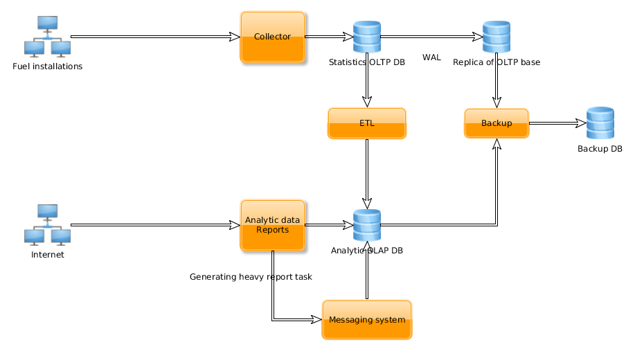

..
 This work is licensed under a Creative Commons Attribution 3.0 Unported
 License.

 http://creativecommons.org/licenses/by/3.0/legalcode

===============================================
Fuel-stat - sending of the anonymous statistics
===============================================

https://blueprints.launchpad.net/fuel/+spec/send-anon-usage

Fuel-stat is the service of collecting anonymous and providing analytical
information about using of the Fuel product.

Problem description
===================

We need to understand how customers are using Fuel. We need to collect
anonymous usage statistics and provide the analytics reports.

We need to send `immediate failure reports`_ to the support team on
failed deployment.

Proposed change
===============

Fuel-stat service is separated into two parts. The first one is statistics
collecting service (collector), the second one is analytical service
(analytic).

   Pic 1. Fuel-stat architecture

.. _`anonymous statistic data`:

Anonymous statistic data includes:

* Operation type (adding cluster, adding node, deployment,
  removing node, e.t.c.)
* Operation start and finish time (in UTC)
* Distribution / OS
* Reference architecture (e.g. HA)
* Network type (Nova-Network, Neutron with VLAN, GRE, NSX, etc.)
* Hypervisor (KVM, QEMU, vCenter, etc.)
* Storage options (Glance w/ Ceph, Glance w/ Swift, Cinder w/ LVM,
  Cinder w/iSCSI, Ceph, etc.)
* Related Projects (Sahara, Murano, Ceilometer, etc.)
* Number of nodes deployed
* Roles deployed to each node
* Number of environments
* Installation anonymous identifier (generated once during installation)
* Fuel version info (build number, release, build id, nailgun sha,
  fuelmain sha, ostf sha, e.t.c.)
* OpenStack version info
* Settings modified on Settings tab
* Interfaces configuration
* Disk layout
* Hardware (so we can differentiate between virtualbox and bare metal installs)
* Network verification - whether it was used, and what was the result
* Networking configuration
* Actual time (in seconds) that is took to complete the operation
* Is there any manual customizations of nodes metadata done
* Kernel parameters
* Admin network parameters
* PXE parameters
* DNS parameters
* Is fuel menu used
* Is OSTF used, and tests results

On some operations we can provide only part of statistic info. All
reports creation logic is implemented in the analytic. All the identifying
information should be sanitized.

.. _`anonymous identifier`:

Statistics is grouped by the unique anonymous identifier which is generated
once during installation or upgrade the Nailgun. This anonymous identifier
can be stored in special named file.

Community and commercial Fuel installations will be provided by different
Fuel-stat instances. So we should provide different URIs of collector and
analytic in community and commercial ISOs.

Collector service provides REST API which available from the internet.
Analytic provides REST API and have UI to viewing stat reports online.
Access to the analytic UI and REST API for commercial instance is limited to
Mirantis network.

Requests and responses in collector and analytic must be validated by
JSON Schema.

Analytic web UI uses analytic API. UI design is out of scope of this
specification.

Each Fuel installation, with enabled anonymous stat option, periodically
sends info to collector API from action logs. Each request and response
to the collector API is validated by JSON scheme. After validation and
processing data saves into collector DB. Collector DB has slave replica.
Periodically data from collector DB extracted, transformed, loaded (ETL)
into analytic DB. For performance issues ETL can be configured to work
with replica DB.

Periodically backup of collector and analytic DBs is made. Collector DB's
backup is made from slave replica due to performance issues.

Analytics information can be accessed through analytic API or web UI. For
heavy analytic reports can be used asynchronous processing, based on tasks
and messaging system.

Sending of anonymous statistics option should be added into Nailgun UI.
Detailed description of sending statistics should be added into Nailgun UI.

Storing of action logs should be added into Nailgun. Each modification
requested through Nailgun API should be stored into DB table action_logs.
Action logs records contains actor (user, performed the operation), action
name, result code, execution time, processing time, and some serialized
additional info. Success and failure operations with error description
are logged. Logged info should be sanitized from any credentials data.
Action logs are saved always and saving is not depends on state of
the 'send anonymous stat' option.

Requests from fuel-cli and fuel-web have custom value in the HTTP header
User-Agent. 'fuel-cli' and 'fuel-web' for simple requests separation.

Handle calculation of execution time for asynchronous tasks. Add execution
time into action_logs.

Sending of statistics from Nailgun to collecting service will be implemented
as background process. This background process should save info about last
sent action log and sends only fresh records. Sending process should not
affect Nailgun services, should be robust to errors. It is started by
supervisor. Also this process on each run sends installation detailed
information: environments number, nodes number and roles, Fuel release info,
OpenStack release info, network configuration, e.t.c.

Requested analytic reports:

* totals/distribution for all the categories of information gathered:

    * how many OS of each type (CentOS/Ubuntu),
    * average deployment time,
    * how many of a given release (2014.2-6.0, 2014.2.1-6.1, etc.)
      are deployed,
    * most common HW server type.

* average number of deployment failures before success for environments,
* total number of node types deployed across customers (e.g. controllers,
  compute, storage, MongoDB, Zabbix, etc.). This should be smart enough
  to recognize combined nodes as well (e.g. where compute and storage are
  on the same node).
* number of failures for specific Health Checks vs. total runs. This would be,
  for example, to identify the most commonly failing test.

.. _`immediate failure reports`:

For sending failure reports collector API is used. On failure all required
information is gathered, combined with `customer contact`_ and sent to the
collector. On the collector side failure report is immediately processed and
notification is sent to the support team. If `customer contact`_ is not
filled only action log of failure will be stored.

Alternatives
------------

None

Data model impact
-----------------

New databases for collector and analytic will be created.

Action_logs table added into Nailgun.

In case of extra-large data amounts DB can be partitioned by DB
migration scripts. If partitioning is required we can introduce it
by creating master table and partitions and moving data into
partitioned table. After that partitioned and original table can be
swapped by renaming.

REST API impact
---------------

REST API for collector and analytic services will be created.
API call for enabling and disabling sending anonymous statistics.

Upgrade impact
--------------

Action logs table should be included into DB migration.

During deployment `anonymous identifier`_ should be generated if it not
generated yet.

After upgrade information about environments, nodes, roles, networks,
releases, e.t.c. will be sent into collector on scheduled action logs
sending.

Security impact
---------------

There are open questions:

* Authentication and authorization in analytic. Is it required?
* HTTPS on collector and analytic API? Have we certificates for wildcard
  third level domains for mirantis.com or single certificate to be issued
  or self signed certificates?
* Protection from data spoofing. Is MasterNode uid enough for checking
  request is not fake?

Notifications impact
--------------------

None

Other end user impact
---------------------

Sending anonymous statistic option added into Fuel UI settings. We must have a
clear, and obvious message that we are collecting data. When "Deploy Changes"
is selected that would preview what information would be sent. Data use policy
should be generated to reference.

.. _`customer contact`:

Customer contact information is added to the settings tab. This information
is used in `immediate failure reports`_ for feedback. Contact information is:

* Last Name, First Name
* Email Address
* Company Name
* Phone Number (optional)
* Job Title (optional)
* Country (optional)

By default, user will be enforced to enter contact information about itself
during first run of Fuel UI after installation or upgrade.

Performance Impact
------------------

None

Other deployer impact
---------------------

We require hosting for collector and analytic services and their DBs.

Collector and analytic services, DBs migrations should be deployed by
puppet manifests.

Community and commercial Fuel installation are provided by different
Fuel-stat instances. Different URIs should be in settings of
community and commercial Fuel distributions.

During deployment `anonymous identifier`_ should be generated if it not
generated yet.

Developer impact
----------------

None

Implementation
==============

Assignee(s)
-----------

Primary assignee:

*  aroma@mirantis.com (Artem Roma)
*  akasatkin@mirantis.com (Alexey Kasatkin)
*  akislitsky@mirantis.com (Alexander Kislitksy)

Other contributors:

*  UI developer
*  DevOps developer
*  QA specialist
*  OSCI specialist

Work Items
----------

Implementation is separated on several stages.

Used technologies
^^^^^^^^^^^^^^^^^

* Programming language - Python 2.7.
* Application server - uWSGI.
* API protocol definition - JSON Schema.
* Web service - Nginx.
* Database - PostgreSQL.
* Slave DB replica - by PostgreSQL native WAL technology.
* DB schema migrations - Alembic.
* ETL - to be defined when analytics reports format will be defined.
  Possible options: Pentaho, Talend, self implemented, e.t.c.

Stage 1
^^^^^^^

All logic should be covered by unittests.

* Configure uWSGI + Nginx + DB. Run simple WSGI application in collector
* Add JSON Schema support and validation of test request/response
* Initiate implementation of puppet manifests for service deployment,
  DBs backup
* Check deployment of collector and analytic, when deployment is ready
* Implement part of collector API and initiate testing and load testing
  of it by QA team
* Initiate implementation of enabling sending statistics and viewing
  `anonymous statistic data`_ by pressing a "more details" button.
  When "Deploy Changes" is selected that would preview what information
  would be sent.
* Implement saving action logs in Nailgun
* Implement sending statistics to collector from Nailgun
* Initiate Nailgun testing by QA
* Implement logic enough for switching to implementation of analytic service
* Implement part of analytic API with JSON validation
* Initiate analytic UI implementation
* Implement full analytic API, collector API
* Testing, fixing
* First release is done

Limitations of the first release:

* No authentication
* Only one DB for collector and analytic
* No ETL
* No replication of collector DB
* No backup of DB
* Heavy analytic reports are not handled
* Only commercial instance is implemented (access to the analytic UI and
  REST API is limited to Mirantis network)
* No OSTF statistic
* No action logs viewing in the Nailgun UI
* No immediate failure reports to the support team

Stage 2
^^^^^^^

* Handle collector DB replication
* Handle collector DB backup
* Improve analytic reports and analytic UI
* Sending OSTF statistic
* Action logs viewing in the Nailgun UI
* Immediate failure reports to the support team

Stage 3
^^^^^^^

* Handle authentication
* Handle SSL in APIs, UI
* Improve analytic reports and analytic UI

Stage 4
^^^^^^^

* ETL
* Separate analytic and collector DBs
* Handle analytic DB backup
* Improve analytic reports and analytic UI
* Community instance is implemented

Stage 5
^^^^^^^

* Handle heavy analytic reports
* Handle data partitioning (if required)
* Improve analytic reports and analytic UI

Dependencies
============

None

Testing
=======

We require those tests:

* APIs integration testing
* APIs load testing
* UI functional testing

Documentation Impact
====================

Option for enabling sending, and `anonymous statistic data`_ details
should be documented.

Collector and analytic APIs will be documented by JSON Schemas (probably by
sphinx).

Analytic reports and analytic UI should be documented.

References
==========

None