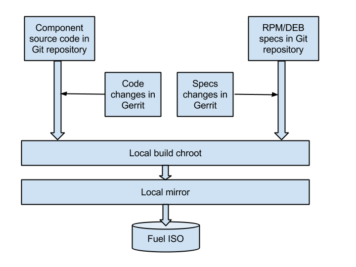

..
 This work is licensed under a Creative Commons Attribution 3.0 Unported
 License.

 http://creativecommons.org/licenses/by/3.0/legalcode

===================================================
Install OpenStack from upstream source repositories
===================================================

https://blueprints.launchpad.net/fuel/+spec/openstack-from-master

Be able to deploy the very latest distribution of OpenStack from upstream
master. This is to provide community developers a way to deploy their own
additional changes through an easy to use deployment technology (i.e. Fuel).

Problem description
===================

* The idea behind that feature is to allow customers to compile OpenStack
  packages during a Fuel ISO build on the fly, both RPM and DEB versions.

* Customers may use spec files either from our public Gerrit, or from their
  own local/remote git repos.

   Figure 1. Build OpenStack packages from master scheme

Proposed change
===============

The fuel-main/config.mk will contain the following new parameters:

* BUILD_OPENSTACK_PACKAGES - contains comma-separated list of OpenStack
  components to build, or "0" otherwise

Per each of OpenStack components, the following list of parameters is defined
(using Neutron as an example):

* NEUTRON_REPO - Git repository to take component sources from
* NEUTRON_COMMIT - code branch to use during "git clone" operation
* NEUTRON_SPEC_REPO - Git repo to take component RPM/DEB specs from
* NEUTRON_SPEC_COMMIT - specs branch to use during "git clone" operation
* NEUTRON_GERRIT_URL- URL of gerrit for source code
* NEUTRON_GERRIT_COMMIT - one or several changes to source code in refspec
  format
* NEUTRON_SPEC_GERRIT_URL - URL of gerrit for RPM/DEB specs
* NEUTRON_SPEC_GERRIT_COMMIT - one or several changes to RPM specs in
  refspec format

These values will take effect only if BUILD_OPENSTACK_PACKAGES parameter
contains a name of respective OpenStack component, i.e.:

BUILD_OPENSTACK_PACKAGES=neutron

It is possible to build specific OpenStack components only, by using make
command with the target component parameter, i.e.:

``make neutron``

Few more examples of common use-cases:

1) build nova + neutron from current master on Github and from Mirantis specs:

``make iso BUILD_OPENSTACK_PACKAGES=nova,neutron``

2) build cinder from stable Icehouse branch on Github and from Mirantis specs:

``make iso BUILD_OPENSTACK_PACKAGES=cinder CINDER_COMMIT=stable/icehouse 
CINDER_SPEC_COMMIT=openstack-ci/fuel-5.1/2014.1.1``

3) build swift from current master with applying code changes from 3rd party
   gerrit:

``make iso BUILD_OPENSTACK_PACKAGES=swift 
SWIFT_GERRIT_URL=https://gerrit.mycompany.com/openstack/swift 
SWIFT_GERRIT_COMMIT="refs/changes/33/127033/1 refs/changes/64/125864/1"``

4) build glance from current master using Mirantis specs with applying specs
changes from 3rd party gerrit:

``make iso BUILD_OPENSTACK_PACKAGES=glance 
SWIFT_SPEC_GERRIT_URL=https://gerrit.mycompany.com/openstack/glance-build 
SWIFT_SPEC_GERRIT_COMMIT="refs/changes/63/5013/1 refs/changes/22/5764/1"``

Alternatives
------------

Using pre-built OpenStack packages from Mirantis or other vendors. This
limits the possibility to use latest code from master, because there
could be a gap between fast changing component requirements in master
and latest specs from vendors. We maintain specs in our public Gerrit
as close as possible to a current state of requirements in master.
Using pre-built packages also makes unable to include your changes to
OpenStack sources and/or specs.

Data model impact
-----------------

None

REST API impact
---------------

None

Upgrade impact
--------------

Rebuilt OpenStack packages could be used for various implementations of
patching of existing environments, few examples are described in the
following blueprints:

* https://blueprints.launchpad.net/fuel/+spec/building-openstack-on-master-node
* https://blueprints.launchpad.net/fuel/+spec/generating-update-mirrors

Security impact
---------------

None

Notifications impact
--------------------

None

Other end user impact
---------------------

* Additional options to the "make iso" command allow user to customize
  external sources to build OpenStack components from.

Performance Impact
------------------

By using this feature to build multiple custom OpenStack components, the total
ISO build time could be significantly higher than "vanilla" Fuel ISO one.

Other deployer impact
---------------------

None

Developer impact
----------------

None

Implementation
==============

Assignee(s)
-----------

Primary assignee:
    Vitaly Parakhin
Mandatory Design Reviewers:
    Roman Vyalov, Dmitry Pyzhov, Dmitry Borodaenko
QA:
    Anastasia Urlapova

Work Items
----------

Initial phase:

* Implement building RPM packages from master - done
* Produce the specs for building RPM from master - done

Second phase:

* Implement building DEB packages from master - in progress
* Produce the specs for building DEB from master - done

Dependencies
============

* https://blueprints.launchpad.net/fuel/+spec/build-packages-for-openstack-master-rpm
* https://blueprints.launchpad.net/fuel/+spec/osci-to-dmz

Testing
=======

The following tests should be performed:

* Building all OpenStack components from master using Mirantis specs
  using default values for all variables
* Building all OpenStack components using all allowed variables explicitly
  specified
* Deployment tests for an ISO with customized OpenStack components

The existing deployment tests are adequate for testing customized ISO.

Acceptance criteria:

* Each of OpenStack components could be built from master using our specs
* Deployment of simple multinode OpenStack succeeds
* Diagnostic snapshot works
* Health Check works

Documentation Impact
====================

* Developer Guide should be updated to include detailed instruction on how to
  use this feature.
* User Guide should reference related section from Developer Guide.

References
==========

None
