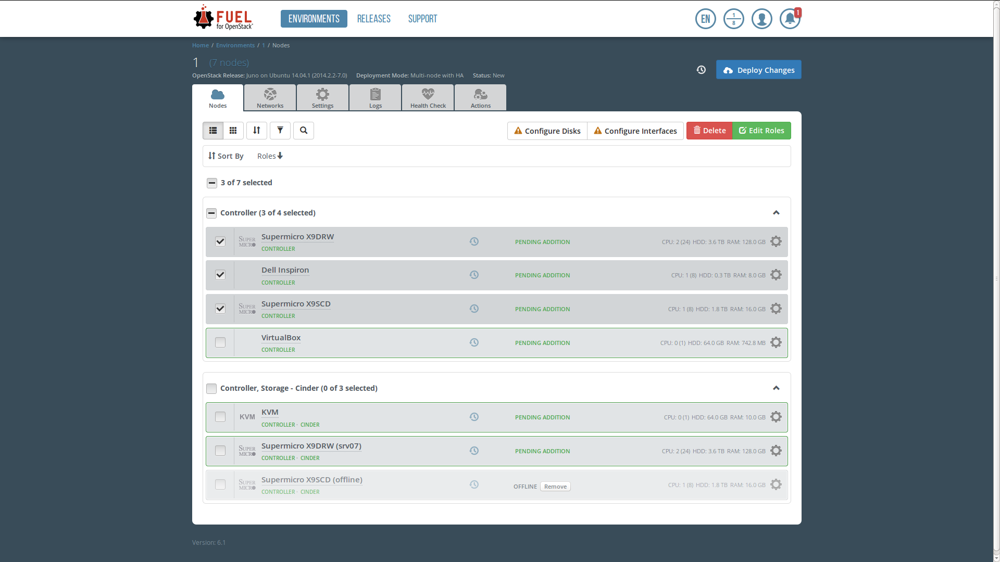
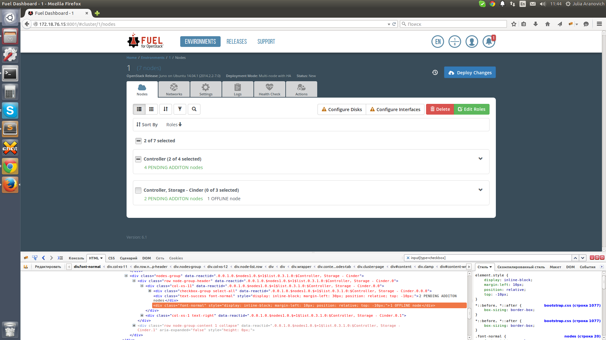

..
 This work is licensed under a Creative Commons Attribution 3.0 Unported
 License.

 http://creativecommons.org/licenses/by/3.0/legalcode

======================================
Collapsible node groups in Fuel Web UI
======================================

https://blueprints.launchpad.net/fuel/+spec/collapsible-node-groups

Implement possibility to collapse and expand node groups in Fuel Web UI.

Problem description
===================

In Fuel Web UI it becomes hard to scroll through a large list of nodes
to observe overall nodes state. As long as nodes are always grouped by their
parameters, that correspond to applied sorting on the screen, user does not
always need to see the entire list of nodes in a group. In most cases nodes
in a group will have not many differences. For everyday work with a cloud some
aggregated information about a node group will be enough.

Proposed change
===============

Collapsible behaviour of node groups should be introduced in Fuel Web UI.

Collapsible node group should represent an aggregated information about its
nodes and a set of controls:

* a title which reflects node parameters by which they are grouped
* number of total nodes in the group
* number of selected nodes in the group
* 'Select All' control to (un)select nodes in the group
* button to toggle the group
* a short summary of node statuses to give user an inportant information
  if some nodes in the group failed or went offline

There are mockups for the feature:

Since environment UI settings can be stored to database, it is suggested to
store collapsed state of environment node groups too. This will help user not
to toggle groups every time he loads environment nodes screen.
Since node grouping depends on applied sorting for node list, sorting applied
to environment node list is also should be stored in DB.
So, these UI settings (collapsed state of node groups, current sorting) should
be saved every time user toggle a node group or change sorting on environment
nodes screen.

As the next iteration UI settings on the screen of unallocated nodes should
also be stored for user too. For now, node list on the screen has default
sorting by node status, which is a significant info on the screen to highlight
error or offline nodes. And node groups are not collapsed by default to better
reflect node hardware configuration.

Alternatives
------------

None

Data model impact
-----------------

New properties ``sorting`` and ``collapsed_groups`` should be added to
``ui_settings`` JSON attribute of ``Cluster`` DB model:

.. code-block:: json

  "ui_settings": {
    "view_mode": "standard",
    "sorting": [
      {"roles": "asc"},
      {"cpu_real": "desc"},
      ...
    ],
    "collapsed_groups": [
      {"roles": ["controller", "cinder"], "cpu_real": 1, ...},
      ...
    ]
  }

Default value of ``ui_settings`` attribute will be:

.. code-block:: json

  "ui_settings": {
    "view_mode": "standard",
    "sorting": [
      {"roles": "asc"}
    ],
    "collapsed_groups": []
  }

This change should be reflected in an appropriate JSON schema.

``sorting`` property represents current sorting in environment and should
be a list of objects of the format ``{sorting_name: sorting_order}``,
where ``sorting_order`` can be "asc" or "desc".

``collapsed_groups`` property represents a list of collapsed groups and should
be a list of objects identifying a group with the format ``{sorting_name_1:
node parameter related to the sorter, sorting_name_2: node parameter related
to the sorter, ...}``.

REST API impact
---------------

No new methods needed.

Existing ``PUT /api/cluster/{cluster_id}`` method should be modified to be able
to accept data (Ok code 200, server error code starting from 500) in the form
of the following JSON:

.. code-block:: json

  {
    "ui_settings": {
      "view_mode": "compact",
      "sorting": [
        {"roles": "asc"},
        {"cpu_real": "desc"},
        ...
      ],
      "collapsed_groups": [
        {"roles": ["controller", "cinder"], "cpu_real": 1, ...},
        ...
      ]
    }
  }

Accordingly, new properties of ``ui_settings`` field should be presented in
the method output:

.. code-block:: json

  {
    "id": 1,
    "name": "cluster#1",
    "release_id": 2,
    ...
    "ui_settings": {
      "view_mode": "compact",
      "sorting": [
        {"roles": "asc"},
        {"cpu_real": "desc"},
        ...
      ],
      "collapsed_groups": [
        {"roles": ["controller", "cinder"], "cpu_real": 1, ...},
        ...
      ]
    }
  }

Similarly existing ``GET /api/cluster/{cluster_id}`` method should return
new properties of ``ui_settings`` cluster attribute.

Upgrade impact
--------------

Since we have a "Data model impact" we have to prepare an Alembic migration
that should update clusters to fit the new format.

Security impact
---------------

None

Notifications impact
--------------------

None

Other end user impact
---------------------

None

Performance Impact
------------------

None

Plugin impact
-------------

None

Other deployer impact
---------------------

None. This feature is about UI changes only, so no new data goes to deployment
info.

Developer impact
----------------

None

Infrastructure impact
---------------------

None

Implementation
==============

Assignee(s)
-----------

Primary assignee:

* Julia Aranovich (jkirnosova@mirantis.com)

Developers:

* Julia Aranovich (jkirnosova@mirantis.com) - JS code
* Bogdan Dudko (bdudko@mirantis.com) - visual design
* Vitaly Kramskikh (vkramskikh@mirantis.com) - Python code

Mandatory Design Reviewer:

* Vitaly Kramskikh (vkramskikh@mirantis.com)

Approver:

* Sheena Gregson <sgregson@mirantis.com>

QA engineer:

* Anastasia Palkina <apalkina@mirantis.com>

Work Items
----------

* Provide a new visual design for collapsible node groups.
* Implement JS part of the task.
* Implement backend changes.

Dependencies
============

* `Node list view modes
  <https://blueprints.launchpad.net/fuel/+spec/node-list-view-modes>`_

* `Sorting and filtering of node list in Fuel Web UI
  <https://blueprints.launchpad.net/fuel/+spec/node-list-sorters-and-filters>`_

Testing
=======

* The feature should be covered by UI functional tests.
* Changes in ``ui_settings`` attribute of ``Cluster`` DB model should be
  covered by Python tests.

Acceptance criteria
-------------------

* User can toggle node groups both on the sc=reen of environment nodes and
  the screen of unallocated nodes.
* Collapsed state of node groups on the screen of environment nodes is stored
  on backend. So user does not need to toggle groups each time he loads the
  screen.
* User can select all nodes in group by an appropriate 'Select All' checkbox.
* Node group title accompanied by numbers of selected and total nodes in
  the group.
* Collapsed node groups show an aggregated node statuses summary.

Documentation Impact
====================

The documentation should cover how the end user experience has been changed.

References
==========

* #fuel-ui on freenode
