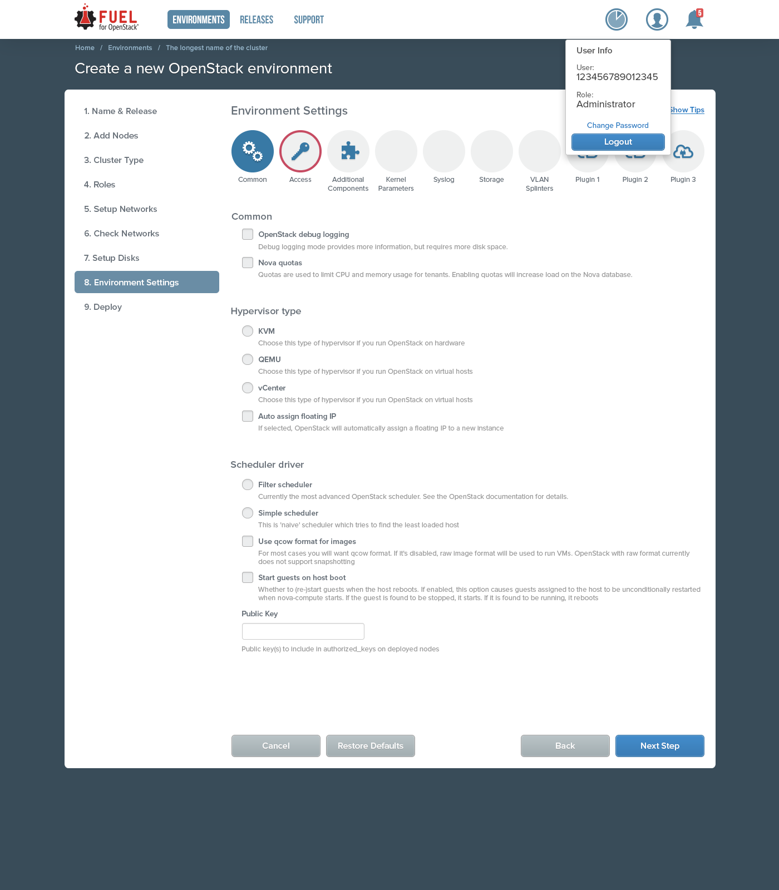

..
 This work is licensed under a Creative Commons Attribution 3.0 Unported
 License.

 http://creativecommons.org/licenses/by/3.0/legalcode

==========================================
Fuel UI Settings Subtabs
==========================================

https://blueprints.launchpad.net/fuel/+spec/fuel-ui-settings-subtabs

Settings will be organized in subtabs to simplify
settings navigation.

Problem description
===================

Fuel settings tab is big and has lots of settings groups. As plugins
are added, things get more complicated. In order to organize the
settings, the concept of subtabs is proposed.

Proposed change
===============

Every settings group will be placed in a separate subtab, every subtab
can be selected using a single mouse click.

Alternatives
------------

Continue to use single page with multiple settings groups.

Data model impact
-----------------

None.

REST API impact
---------------

None.

Upgrade impact
--------------

No external dependencies added

Security impact
---------------

No impact

Notifications impact
--------------------

No impact

Other end user impact
---------------------

End user will see the new Settings tab appearance in Fuel UI.
No command-line client impact.

Performance Impact
------------------

Not applicable

Plugin impact
-------------

Every plugin can add a settings group and therefore, subtab.
Subtabs number is not limited, althouh it may have impact on
UI usability

Other deployer impact
---------------------

No impact

Developer impact
----------------

No impact

Infrastructure impact
---------------------

No impact

Implementation
==============

Assignee(s)
-----------

Primary assignee:

  Anton Zemlyanov - azemlyanov

Other contributors:

 Anastasiya Palkina (QA) - apalkina
 Bogdan Dudko (UI Design) - bdudko
 Vitaly Kramskikh (Mandatory reviewer) - vkramskikh

Work Items
----------

- prepare icons for subtabs
- implement settings tab subtabs

Dependencies
============

none

Testing
=======

- manual testing
- UI functional test for Settings tab should be updated

Acceptance criteria
-------------------

- all the functional UI tests pass
- clicking on a subtab switches to it
- on leaving tab with changes save requested

Documentation Impact
====================

Fuel Users Guide should be updated, Settings tab section

References
==========

None
