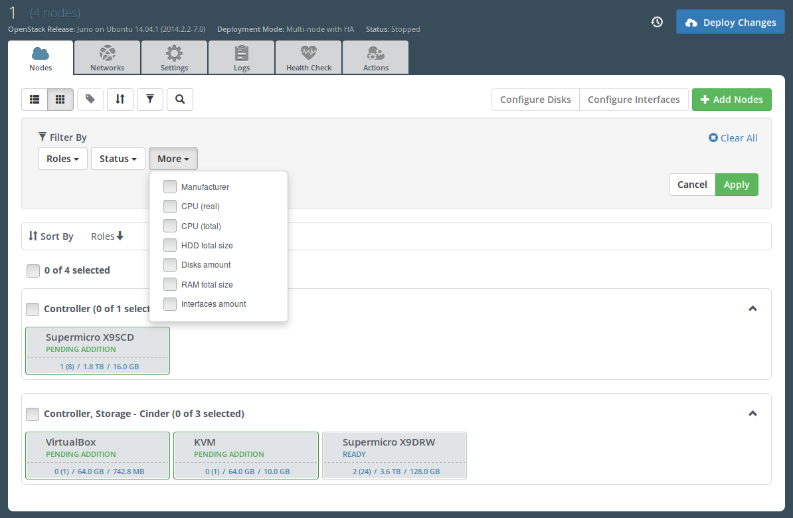
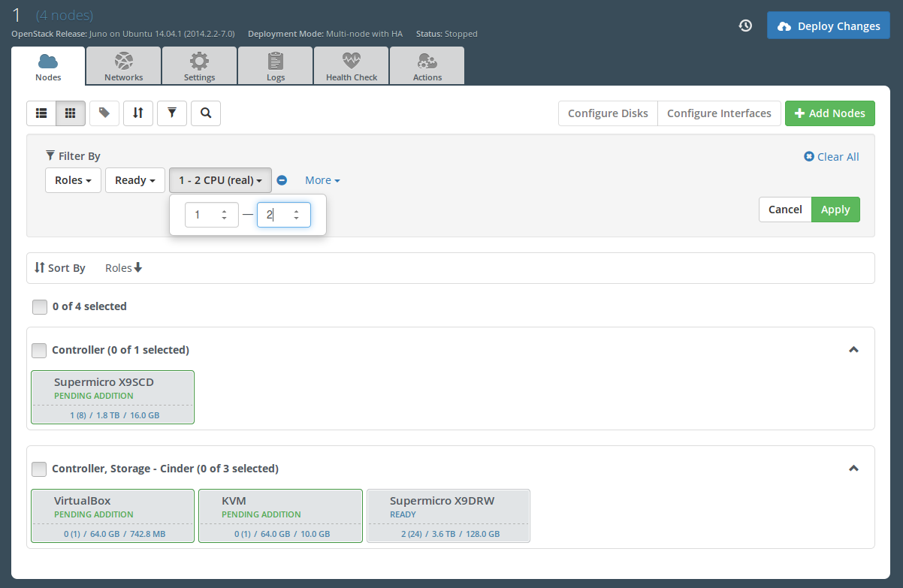
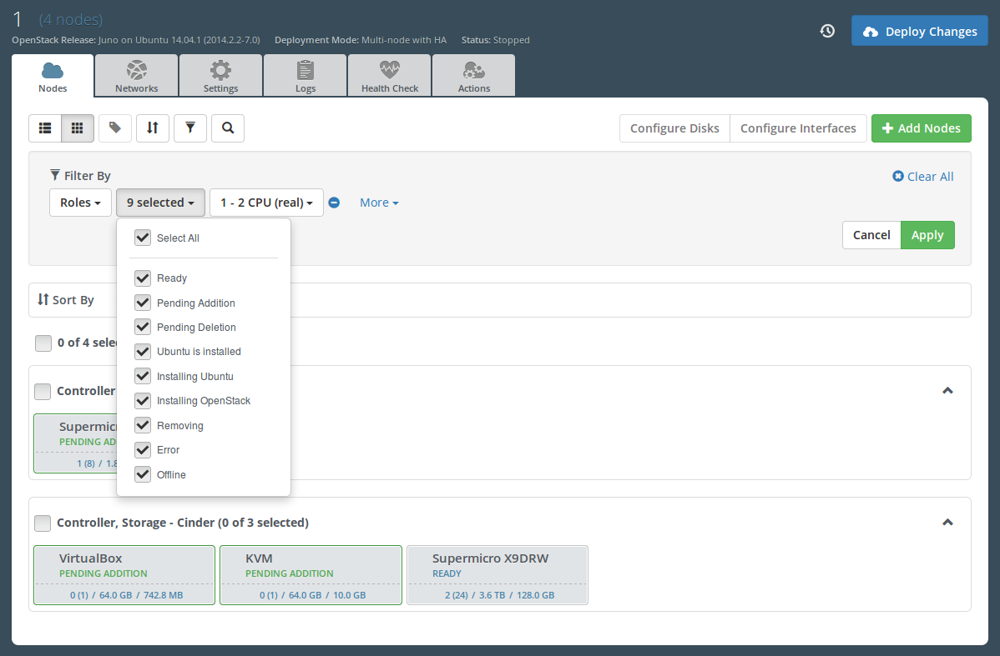
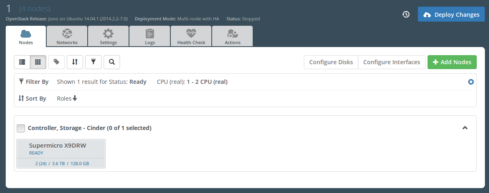
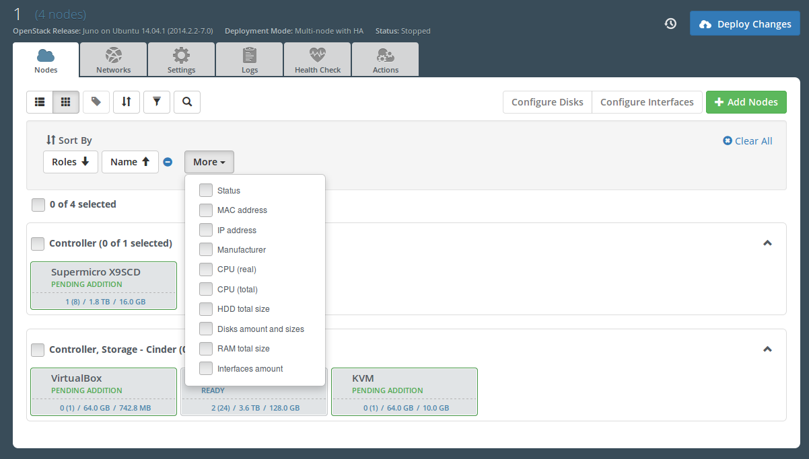

..
 This work is licensed under a Creative Commons Attribution 3.0 Unported
 License.

 http://creativecommons.org/licenses/by/3.0/legalcode

============================================
Node list sorters and filters in Fuel Web UI
============================================

https://blueprints.launchpad.net/fuel/+spec/node-list-sorters-and-filters

Implement possibility to sort and filter nodes based on its properties
(e.g. name, status, etc) so that user can work efficiently with large number
of nodes in Fuel UI

Problem description
===================

Now user can filter nodes just by their name or MAC address using simple text
field only and no special sorters are available for node list. Nodes are
automatically sorted by their id attribute that is useless for the end user.

It is rather poor UI for managing large environments. There are many use cases
that are desirable to maintain in the Fuel UI. For example, an ability
to filter/sort nodes by their deployment status or online state would save
some time finding faulty/offline nodes in the list and performing bulk actions
(like Delete) on them.

Proposed change
===============

We should introduce a form-based panels on node list screens in UI with
filtering and sorting controls based on node attributes.

If there is a predefined list of node attribute values then the filter control
should be a dropdown with list of checkboxes, representing these values, with
multiple choice support. If node attribute is a number, the dropdown should
contain two text fields to set minimum and maximum values for the attribute.
In other cases filtering is performed by a single text search field.

Filter bar has some default filters (will be described below) and new ones
can be added from the list of all possible filters. Non-default filters
can be deleted from the bar.

Applying the filters should be performed by click on Apply button in the
filter bar.

User should also have an ability to sort node list by multiple node attributes
both in forward (ascending) and reverse (descending) order. The order can be
set separately for each sorter (ascending is default).

Sorting bar has default sorter (will be described below) and new ones
can be added from the list of all possible sorters. Non-default sorters
can be deleted from the bar.

Applying the sorting is performed immediately by adding new sorter or changing
an order of the existing one.

Both sorting and filter bars should be extendable for adding custom user
filters or sorters and should have Clear All button in order
to help user immediately reset the selection to default and not to change
each control.

Node list should include info about filtering results: amount of filtered
nodes and names of applied filters with its selected values. Node list should
also include info about applied sorters.

Existing grouping control in node management panel will be totally replaced
by sorting functionality. Sorted node list should be grouped by the sorting
parameters to provide the user a UI for effective node group selection.
For example, if a node list is sorted by roles and deployment status, then
there will be groups by combination of roles and status in the list.

Sorting by node name, IP or MAC address does not involve grouping because
these attributes are unique for each node.

Below describes all possible filters for each of node list screens.

* screen of environment nodes

  * **ROLE** filter is default filter and its values are the list of
    environment release roles (release model ``roles`` attribute).
  * **STATUS** filter is default filter and should have the following values:

    * **ready** - checks node ``status`` attribute
    * **pending addition** - checks node ``pending_addition`` attribute
    * **pending deletion** - checks node ``pending_deletion`` attribute
    * **provisioned** - checks node ``status`` attribute
    * **provisioning** - checks node ``status`` attribute
    * **deploying** - checks node ``status`` attribute
    * **removing** - checks node ``status`` attribute
    * **error** - checks node ``status`` attribute
    * **offline** - checks node ``offline`` attribute

  * **MANUFACTURER** filter values are the list of ``manufacturer`` attribute
    value from all nodes on the screen.
  * **CPU (real)** filter with ability to set number range of the real CPU
    amount.
  * **CPU (total)** filter with ability to set number range of the total CPU
    amount.
  * **HDD total size** filter with ability to set number range of node total
    HDD size.
  * **DISKS** filter with ability to set number range of node disks amount
    (this filter is directly used to apply batch disks configuration).
  * **RAM total size** filter with ability to set number range of node total
    memory size.
  * **INTERFACES** filter with ability to set number range of node interfaces
    amount (this filter is directly used to apply batch interfaces
    configuration).

* screen of unallocated nodes

  * **STATUS** filter is default filter and should have the following values:

    * **error** - checks node ``status`` attribute
    * **offline** - checks node ``offline`` attribute

  * **MANUFACTURER** filter values are the list of ``manufacturer`` attribute
    value from all nodes on the screen.
  * **CPU (real)** filter with ability to set number range of the real CPU
    amount.
  * **CPU (total)** filter with ability to set number range of the total CPU
    amount.
  * **HDD total size** filter with ability to set number range of node total
    HDD size.
  * **DISKS** filter with ability to set number range of node disks amount
    (this filter is directly used to apply batch disks configuration).
  * **RAM total size** filter  with ability to set number range of node total
    memory size.
  * **INTERFACES** filter with ability to set number range of node interfaces
    amount (this filter is directly used to apply batch interfaces
    configuration).

Both environment nodes and unallocated nodes screens also should have
a simple **Search nodes** text field for case insensitive filtering nodes by
the following attributes:

* **name** - checks node ``name`` attribute
* **MAC address** - checks node ``mac`` attribute
* **IP address** - checks node ``ip`` attribute

Below describes all the possible sorters for each of node list screens.

* screen of environment nodes

  * **roles** - default sorting. Nodes should have the same order as in
    environment release role list.
  * **name** - natural sorting by node ``name`` attribute ('123asd',
    '19asd', '12345asd', 'asd123', 'asd12' should turn into '19asd', '123asd',
    '12345asd', 'asd12', 'asd123').
  * **status** - preffered order for sorting of nodes is 'ready',
    'pending addition', 'pending deletion', 'provisioned', 'provisioning',
    'deploying', 'removing', 'error' (node 'status', 'pending_addition',
    'pending_deletion' attributes are checked).
  * **offline** - nodes with falsy ``online`` attribute go first.
  * **manufacturer** - natural sorting by node ``manufacturer`` attribute.
  * **IP address** - natural sorting by node ``ip`` attribute.
  * **MAC address** - natural sorting by node ``mac`` attribute.
  * **CPU (real)** - numeric sorting by node real CPU amount.
  * **CPU (total)** - numeric sorting by node total CPU amount.
  * **HDD total size** - numeric sorting by node HDD total size (a sum of node
    disk sizes).
  * **disks amount and sizes** - multiple numeric sorting by amount of node
    disks and its sizes (this sorting is directly used to apply batch disks
    configuration).
  * **RAM total size** - numeric sorting by node total memory size.
  * **interfaces** - numeric sorting by amount of node interfaces (this
    sorting is directly used to apply batch interfaces configuration).

* screen of unallocated nodes

  * **status** - default sorting. Nodes with 'error' or 'offline' ``status``
    attribute go last.
  * **name** - natural sorting by node ``name`` attribute.
  * **offline** - nodes with falsy ``online`` attribute go first.
  * **manufacturer** - natural sorting by node ``manufacturer`` attribute.
  * **IP address** - natural sorting by node ``ip`` attribute.
  * **MAC address** - natural sorting by node ``mac`` attribute.
  * **CPU (real)** - numeric sorting by node real CPU amount.
  * **CPU (total)** - numeric sorting by node total CPU amount.
  * **HDD total size** - numeric sorting by node HDD total size (a sum of node
    disk sizes).
  * **disks amount and sizes** - multiple numeric sorting by amount of node
    disks and its sizes (this sorting is directly used to apply batch disks
    configuration).
  * **RAM total size** - numeric sorting by node total memory size.
  * **interfaces** - numeric sorting by amount of node interfaces (this
    sorting is directly used to apply batch interfaces configuration).

All the sorters above are described with the assumption of direct sorting
order (ascending).

**SCREEN OF ROLE MANAGEMENT** should not have neither filter nor sorting bar
because all nodes are always chosen on this screen and sorting by roles only
does make sense on the screen.

User selection for filters and sorters is not stored neither on the backend
nor in browser cookies. But the selection (except the data from Search field)
is automatically translated to page location string as a simple urlencoded
javascript object:

.. code-block:: text

  #cluster/1/nodes/list/{%22filter%22%3A{%22roles%22%3A[%22compute%22%2C
  %22cinder%22]%2C%22status%22%3A[%22ready%22]}%2C%22sort%22%3A[{%22roles
  %22%3A%22asc%22}%2C{%22status%22%3A%22desc%22}]}

There are mockups for the feature:

.. image:: ../../images/7.0/node-list-sorters-and-filters/applied-sorters.png

Alternatives
------------

The alternative here can be query-based language for filtering and sorting
nodes, that looks like:

.. code-block:: text

  status = error AND role in (controller, compute) and online = true
  ORDER BY name ASC, role DESC

This method is rather flexible and requires no support when adding new node
properties. This feature is planned as the next iteration within node
management optimization task.

Node list sorting anf filtering can also be done on server side.
This way will allow not to transfer all nodes with their data each time through
REST API and will increase speed and velocity of server-client interactions.
This alternative is out of scope of this task because of the lack of resources
and the need of preliminary refactoring of Nailgun API.

Data model impact
-----------------

Existing ``grouping`` attribute of ``Cluster`` model is no longer needed.

REST API impact
---------------

Filtering and sorting support in Nailgun API is highly desirable but should be
considered as a separate task. This specification is about UI changes only.

Upgrade impact
--------------

Since we have a "Data model impact" we have to prepare an Alembic migration
that should update clusters to fit the new format.

Security impact
---------------

None.

Notifications impact
--------------------

None.

Other end user impact
---------------------

None.

Performance Impact
------------------

None.

Plugin impact
-------------

None.

Other deployer impact
---------------------

None.

Developer impact
----------------

None.

Infrastructure impact
---------------------

None.

Implementation
==============

Assignee(s)
-----------

Primary assignee:

* Julia Aranovich (jkirnosova@mirantis.com)

Developers:

* Julia Aranovich (jkirnosova@mirantis.com) - JS code
* Vitaly Kramskikh (vkramskikh@mirantis.com) - Python code
* Bogdan Dudko (bdudko@mirantis.com) - visual design

Mandatory Design Reviewer:

* Vitaly Kramskikh (vkramskikh@mirantis.com)

Approver:

* Sheena Gregson (sgregson@mirantis.com)

Work Items
----------

* Fix the list of node attributes to filter with all possible values.
* Fix the list of node attributes to sort with all possible values.
* Implement the new filter bar for node management.
* Implement the new sorting bar for node management.
* Automatically update page location string with user sorting and filtering
  selection.

Dependencies
============

None.

Testing
=======

* Filtering and sorting node list features should be covered by UI functional
  tests.
* Python unit tests should be revisited because of removal of ``Cluster``
  model ``grouping`` attribute.

Acceptance criteria
-------------------

* User can filter lists of nodes to show only nodes that are characterized
  by specified parameters.
* User can sort nodes based on a parameter type (ascending, descending) or
  on multiple parameters.
* Sorted node list is grouped by sorting parameters.
* Filtering and sorting selections are transformed to url location string.

Documentation Impact
====================

The documentation should cover how the end user experience has been changed.

References
==========

#fuel-ui on freenode
