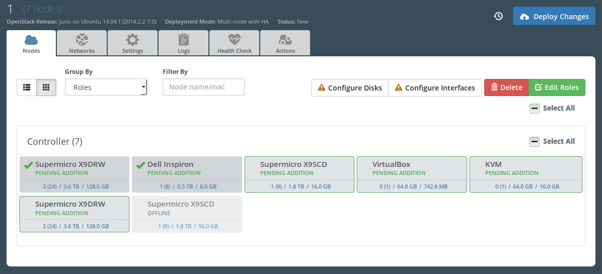
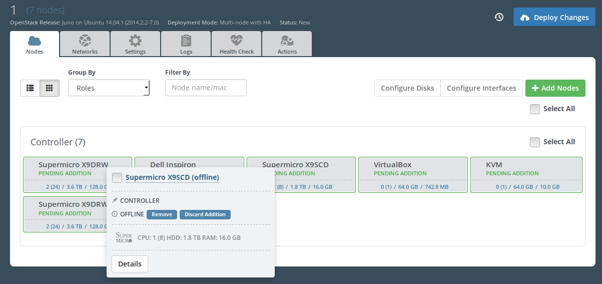
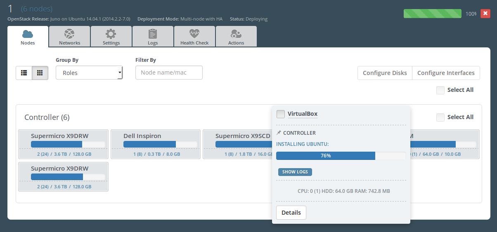

..
 This work is licensed under a Creative Commons Attribution 3.0 Unported
 License.

 http://creativecommons.org/licenses/by/3.0/legalcode

====================================================
Node list standard and compact view modes in Fuel UI
====================================================

https://blueprints.launchpad.net/fuel/+spec/node-list-view-modes

Implement possibility to switch between standard and compact node list view
modes.

Problem description
===================

In big environments it becomes hard to manage a large number of nodes.

Node panel takes an entire row on environment nodes screen now and End User
is forced to scroll through a large list of nodes before finding
the right one.
At the same time not all information on a node panel is needed for everyday
work with operational cloud.

Proposed change
===============

We should introduce a compact view for a clickable node panel which shows
the most significant information about the node such as:

* name
* status (including deployment progress bar)
* hardware information (HDD/CPU/RAM) in a short form
* checked state

And add an ability to switch between standard and compact modes in particular
environment. The choice should be stored in the database, so user UI settings
will be the same for every client.

Standard mode should be default view mode for new environments.

Switching node list view is always available  and does not depend on
environment status.

In compact mode there should be about 5 nodes in row in the node list.

When user hovers a compact node it should transform to extended view with more
detailed info:

* name (with ability to rename the node)
* status (including deployment progress bar)
* checked state
* role list
* hardware information (HDD/CPU/RAM) in a short form
* action buttons (such as Discard Addition, Discard Deletion, Remove
  (for offline nodes), View Logs)
* Details button to launch node pop-up with detailed hardware information.

There are mockups for the feature:

Alternatives
------------

None

UX impact
-----------------

Proposed solution mostly affects UI/UX:

* New control for changing node list view mode should be added in a node
  management panel.
* A node panel should have a new layout in case of 'compact' mode with less
  node data.
* Compact node panel should transform to extended view with more details when
  user hovers a node.
* The proposed change does not affect neither standard node view nor existing
  node pop-up with detailed hardware configuration.

Data model impact
-----------------

Existing ``grouping`` column should be removed from ``Cluster`` model into
Nailgun. At the same time new ``ui_settings`` attribute of JSON type should be
added to ``Cluster`` model with the following default value:

.. code-block:: json

  {
    "view_mode": "standard",
    "grouping": "roles"
  }

This attribute should contain all UI settings of specific environment
including node list grouping mode, that stored in ``grouping`` field of
``Cluster`` model now.

This is an extendable way to handle future UI changes and not to create a big
amount of additional fields in ``Cluster`` model.

This new ``ui_settings`` field should be validated on backend using JSONA
schema.
"view_mode" property has one of the following values: "standard" (default) or
"compact".
"grouping" property has one of the following values: "roles" (default),
"hardware" or "both".

REST API impact
---------------

No new methods needed.

Existing ``PUT /api/cluster/{cluster_id}`` method should be modified to be able
to accept data (Ok code 200, server error code starting from 500) in the form
of the following JSON:

.. code-block:: json

  {
    "ui_settings": {
      "view_mode": "compact",
      "grouping": "roles"
    }
  }

Accordingly, this new ``ui_settings`` field should be added to the method
output:

.. code-block:: json

  {
    "id": 1,
    "name": "cluster#1",
    "release_id": 2,
    ...
    "ui_settings": {
      "view_mode": "compact",
      "grouping": "roles"
    }
  }

Similarly existing ``GET /api/cluster/{cluster_id}`` method should return
the new field.

Upgrade impact
--------------

Since we have a "Data model impact" we have to prepare an Alembic migration
that should update clusters to fit the new format.

Security impact
---------------

None

Notifications impact
--------------------

None

Other end user impact
---------------------

None

Performance Impact
------------------

None

Plugin impact
-------------

None

Other deployer impact
---------------------

None

Developer impact
----------------

None

Infrastructure impact
---------------------

None

Implementation
==============

Assignee(s)
-----------

Primary assignee:

* Julia Aranovich (jkirnosova@mirantis.com)

Developers:

* Julia Aranovich (jkirnosova@mirantis.com) - JS code
* Bogdan Dudko (bdudko@mirantis.com) - Design
* Vitaly Kramskikh (vkramskikh@mirantis.com) - Python code

Mandatory Design Reviewer:

* Vitaly Kramskikh (vkramskikh@mirantis.com)

Approver:

* Sheena Gregson <sgregson@mirantis.com>

QA engineer:

* Anastasia Palkina <apalkina@mirantis.com>

Work Items
----------

* provide a control to switch between standard and compact node list views
* implement a new compact node panel layout
* implement layout of an extended view of compact node

Dependencies
============

None

Testing
=======

* This new Fuel UI feature should be covered by UI functional tests.
* Addition of ``ui_settings`` attribute to ``Cluster`` model should be covered
  by Python tests.

Aceptance criteria
------------------

* User can switch between standard and compact view mode on environment nodes
  screen. The view mode choice is saved for particular environment, so user
  does not need to switch again when he returned to environment.
* When switching to compact view node panels should transform to their compact
  view.
* Compact node panel tranforms to extended view with more detailed information
  when user hovers a node.

Documentation Impact
====================

The documentation should cover how the end user experience has been changed.

References
==========

* #fuel-ui on freenode
