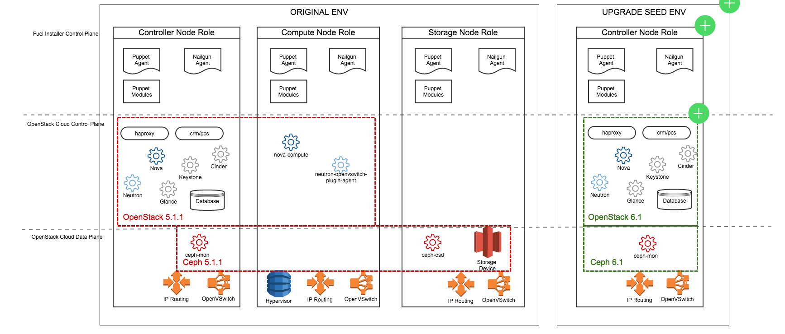
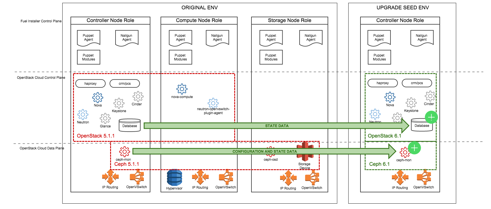
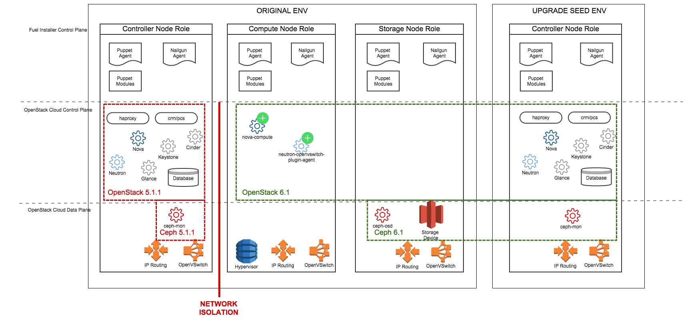
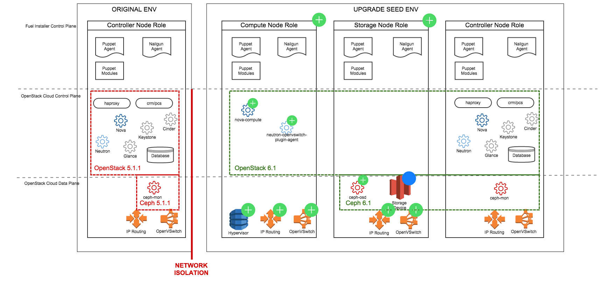

..
 This work is licensed under a Creative Commons Attribution 3.0 Unported
 License.

 http://creativecommons.org/licenses/by/3.0/legalcode

=======================================================
Upgrade An OpenStack Environment To A New Major Release
=======================================================

`<https://blueprints.launchpad.net/fuel/+spec/upgrade-major-openstack-environment>`_

Supporting OpenStack cloud environment beyond single major release requires
that the deployment automation engine that manages the environment allows to
upgrade OpenStack control plane and data plane software between major releases.

Problem description
===================

The new features of OpenStack must be made available to users of Fuel with
minimal impact on their workloads, i.e. virtual machines, connected virtual
resources and applications that run on top of this infrastructure.

The upgrade of OpenStack environment involves upgrade of the following
components (see diagrams below):

* Deployment automation engine (Fuel installer) to support installation of
  software of the new release.

* OpenStack control plane services on Controller nodes, Compute nodes,
  including API servers and others.

* Platform control plane services on Controller nodes (e.g. Ceph MONs/OSDs).

* Data plane software, including hypervisor, virtual switches, kernel etc.

Functional requirements
-----------------------

These requirements define functional aspect of the solution. The proposed
procedure upgrades an environment running OpenStack and installed by Fuel
from 6.x to 7.0 release and meet the following criteria:

* No in-place upgrade is supported in 7.0 release. Every host must be
  re-installed from scratch during the procedure. In-place upgrade will be
  implemented in the future.

* Only core OpenStack services are upgraded:

    * Nova
    * Cinder
    * Neutron
    * Glance
    * Keystone
    * Heat

* Upgrade of OpenStack services assumes that OpenStack APIs will be made
  read-only for the period of the upgrade procedure.

Non-functional requirements
---------------------------

The following requirements define characteristics of the solution.

* Downtime of storage, network and compute resources due the upgrade procedure
  must be kept at minimum through leverage of live migration techniques where
  possible.

* Upgrade solution must work on reference architectures that include the
  following components:

    * High availability architecture (including Galera MySQL, HAProxy and
      Corosync/Pacemaker)
    * Ubuntu operating system
    * KVM hypervisor
    * Neutron networking manager with OVS+VLAN plugin
    * Cinder virtual block storage volumes
    * Ceph shared storage for volumes and ephemeral data
    * Ceph shared storage for images and object store

* Upgrade solution must not require from users to provide more than 3
  hardware servers in addition to servers already existing in their
  environment.

Proposed change
===============

We propose to develop and implement a solution that allows to upgrade an
OpenStack environment in Fuel from version 2014.2.2-6.1 to version 2015.1-7.0.
This solution will rely on certain functions of the Fuel installer, and will
have external component that orchestrates the upgrade process.

This proposal only covers external upgrade orchestration script. Implementation
of functions of Fuel installer used by this script are out of scope of this
proposal.

Upgrade strategy implemented in the proposed upgrade script involves
installation of new Controllers side by side with the ones being upgraded.
Resource nodes are redirected to the new Controllers and eventually upgraded
with minimal move of data. Under Resource nodes we understand nodes with
Compute and/or Storage roles. Resource nodes are upgraded by reinstallation on
the same hardware, keeping user data intact on storage devices separated from
Operating System boot device on the node. Reinstallation is carried out by the
Fuel installer.

The reason to have external script that performs operations outlined above is
that it has to orchestrate at least 2 OpenStack environments: the original
one picked for upgrade and the new one, upgraded. Fuel currently can only
handle a single environment at a time. It doesn't have a component that can
orchestrate multiple environments.

Upgrade Scenario
----------------

The proposed solution to the upgrades problem includes the following general
steps described below in more details:

* Hardware servers are added to installation to serve as Cloud Infrastructure
  Controllers for upgraded environment.

* Cloud Infrastructure Controllers for OpenStack of the new release installed
  on those servers using new version of Fuel, side-by-side with the original
  6.x environment.

* All OpenStack platform services are put into Maintenance Mode for the whole
  duration of upgrade procedure to prevent user data loss and/or corruption.

* State databases of all upgradeable OpenStack components are copied to new
  controllers and upgraded by standard ‘database migration’ feature of
  OpenStack.

* Reconfigure Ceph cluster in such a way that Monitors on the new 7.0
  controllers replace Monitors in 6.x environment, retaining original IP
  addresses and configuration parameters.

* 7.0 controllers replace original 6.x ones and take over their Virtual IPs
  and individual IPs in Management and Public networks.

* Control plane services on Compute nodes in 6.x environment are upgraded
  to 2015.1-7.0 without affecting virtual server instances and workloads.
  After upgrade, Compute service reconnects to 7.0 controllers. Computes and
  controllers communicate using 2015.1 (Kilo) version of RPC.

* Compute nodes from 6.x environment work with CICs from 7.0 environment,
  creating hybrid temporary OpenStack environment that is only used to upgrade
  Compute nodes one by one by re-assigning to 7.0 environment and
  re-installing with new version.

* Ceph OSD nodes from 6.x environment transpartently switch to new Monitors
  without actual data moving in the Ceph cluster.

* User data stored on OSD nodes must be preserved through re-installation of
  nodes into new release of operating system and OpenStack services, and OSD 
  nodes must connect to Monitors without changing their original IDs and data
  set.

We propose to develop script called ``octane`` that will facilitate stages of
upgrade procedure outlined above. Every step is implemented as a subcommand to
the main script:

* ``patch-fuel`` - apply patches to the Fuel Master components to facilitate 
  the behavior required for upgrade procedure. This is only required once per
  upgrade procedure, no matter how many environments you are going to upgrade.
  Doesn't accept arguments. Reverted by ``cleanup-fuel`` command in the end of
  procedure.

* ``upgrade-env`` - this command creates Upgrade Seed environment of version
  2015.1-7.0. Accepts an ID of environment picked for upgrade and optionally
  IDs of unallocated nodes in Fuel inventory to deploy as controllers in the
  Upgrade Seed environment.

* ``upgrade-db`` - this command transfers and upgrades a state database from
  the environment being upgraded to Upgrade Seed environment. Accepts an ID of
  Upgrade Seed environment as an argument.

* ``upgrade-ceph`` - this command updates configuration of Ceph cluster in
  Upgrade Seed environment to match the original Ceph cluster. Accepts an ID
  of Upgrade Seed environmetn as an argument.

* ``upgrade-control`` - this command upgrades control plane of OpenStack cloud
  by replacing 2014.2.2-6.1 controllers with 2015.1-7.0 controllers on the
  same IP addresses and updating control services on hypervisor nodes. Requires
  an ID of Upgrade Seed environment as an argument.

* ``upgrade-node`` - this command upgrades a node, depending on roles assigned
  to it in the original environment. Takes an ID of node and an ID of Upgrade
  Seed environment as arguments.

* ``cleanup-env`` - command to fix an Upgrade Seed environment of artifacts of
  the original environment. Accepts an ID of Upgrade Seed environment as an
  argument.

* ``cleanup-fuel`` - command to revert patches applied to the Fuel Master
  node.

Alternatives
------------

The side-by-side strategy of upgrade of a cloud has an alternative of fully
in-place solution. In that case, no data nor metadata are moved in the cloud.
All  software components are updated on the same set of hardware. Metadata is
converted into format of the new version. Data remain where it were.

This type of upgrade, in theory, must be more seamless then side-by-side
variant. However, in complex architectures like Fuel HA Reference Architecture,
multiple components that interact with each other make it extremely difficult.
Various race conditions in upgrade flow can cause severe interruptions to the
virtual infrastructure and workloads running on top of it.

Potential solution to this problem (to be researched in the future releases)
is to use containers for all OpenStack and platform services in the cluster.

The eventual goal of upgrade user story in Fuel is to make it possible to
upgrade OpenStack control plane and data plane in-place without interruption
of virtual resources and end user's workloads.

Data model impact
-----------------

Upgrade script itself does not require any changes in Fuel or OpenStack data
models. Accompanying proposals for new functions in Fuel that the upgrade
script uses, on the other hand, might have impact on data models. That impact
is described in the corresponding specifications.

REST API impact
---------------

Upgrade script doesn't have an impact on REST API. Supporting features 
proposed to Fuel might have such an impact. This is described in corresponding
specifications in more details.

Upgrade impact
--------------

This change implements the upgrade process as an external script that
orchestrates 2 OpenStack environments: original and new version.

Proposed solution depends on the ability to upgrade the Fuel Master node.
Before upgrading cluster, user needs to upgrade the Fuel master node. It will
allow the user to create an Upgrade Seed environment with 2015.1-7.0 release
version and install Controller nodes which will be used in upgraded OpenStack
cloud. It also gives an ability to upgrade Compute nodes by installing
them with 2015.1-7.0 version of OpenStack.

Security impact
---------------

Upgrade is a high-risk procedure from security standpoint. It requires
administrative access to both environments involved in upgrade.

Notifications impact
--------------------

No impact.

Other end user impact
---------------------

End users of upgrade script are cloud operators wanting to upgrade their
clouds. This proposal introduces a new CLI tool for them that guides them
through the upgrade procedure.

Users of the cloud are impacted by this procedure. During the upgrade, cloud
APIs are in maintenance mode and inaccessible, so users can't provision
resources.

Existing virtual machines in the cloud might experience temporary network
disruptions in the course of the upgrade procedure due to restarting of
OpenStack virtual networking. Live migration used in upgrade of Compute nodes
might cause virtual machines to be suspended for short periods of time.

Performance Impact
------------------

Performance of existing virtual resources might be impacted by the upgrade
procedure. Upgrade of Ceph OSD nodes involves reboot, and that may lead to
degraded performance of storage provided to virtual machines.

Plugin impact
-------------

To upgrade the environment installed using one or more plugins, the following
requirements must be satisifed:

* All plugins have versions that are compatible with version 2015.1-7.0 of
  OpenStack and Fuel.

* If current version of plugin is not compatible with version 2015.1-7.0 of
  OpenStack, new version installed onto Fuel Master as a part of the upgrade
  procedure.

Other deployer impact
---------------------

Proposed script can be packaged as a Python application and distributed with
Fuel as a part of Fuel repository, or separately via Python package management
system (``pip``)

Developer impact
----------------

No impact.

Infrastructure impact
---------------------

This change will require the whole Upgrade CI infrastructure to be built. This
script must be run against any changes that are being backported to 7.0
branch.

Implementation
==============

This is an overview of architecture of the upgrade script and how the things
work with each other during the procedure.

Fuel API allows to manage a single environment and perform operations on nodes
in the environment. Side-by-side upgrade concept implies that some operations
have to be performed on more than one environment at a time. This logic
doesn't belong to Fuel API and must be implemented as an outside script.

Assignee(s)
-----------

Primary assignee:
  gelbuhos (Oleg Gelbukh)

Other contributors:
  sryabin (Sergey Ryabin)
  ikharin (Ilya Kharin)
  yorik.sar (Yuriy Taraday)
  smurashov (Sergey Murashov)

QA:
  smurashov (Sergey Murashov)

Mandatory reviewers:
  mscherbakov (Mike Scherbakov)
  vkuklin (Vladimir Kuklin)
  

Work Items
----------

#. Develop a Python library capable of communicating to all components
   involved in the upgrade procedure, including Fuel, OpenStack and nodes
   command shell.

#. Implement business logic of upgrade procedure as a layer above library
   developed in #1. This logic must support variable upgrade paths and
   interchangeable architecture options as plugins.

#. Implement CLI for the upgrade procedure logic. CLI must have split the
   upgrade procedure into definite steps. Every step must allow validation
   of the upgrade progress, integrity of data and availability of resources.

#. Create functional tests to measure impact of the upgrade procedure on
   virtual resources.

#. Create integration tests to verify the flow of upgrade procedure in an
   automated fashion.

Dependencies
============

* Extended environment object in Nailgun API ('upgrade seed' environment):
  `<https://blueprints.launchpad.net/fuel/+spec/nailgun-api-env-upgrade-extensions>`_

* Versioned unified objects in Nailgun
  `<https://blueprints.launchpad.net/fuel/+spec/nailgun-unified-object-model>`_

* Volume manager refactoring
  `<https://blueprints.launchpad.net/fuel/+spec/volume-manager-refactoring>`_

* Partition preservation
  `<https://blueprints.launchpad.net/fuel/+spec/partition-preservation>`_

Testing
=======

Testing of the script itself will require upgrading the Fuel Master
node during the integration/system test run:

* Fuel 6.x must be installed and environment created by it

* The Fuel Master node must be upgraded to version 7.0 (potentially through
  version 6.1 as an interim stage)

* Script shall be executed on the Fuel Master node.

* Environment of version 7.0 will be created with a set of Controller nodes.

* Compute/Storage nodes will be moved from original version 6.x environment
  to the new 7.0 environment.

* Integration tests must verify results of every step of the upgrade procedure
  for actual vs. expected results.

* Integration tests must validate that the resulting environment has all the
  capabilities and parameters of the original environment.

* Functional tests must validate impact on the cloud end user's workloads.

Documentation Impact
====================

Documentation for the upgrade script must be integrated into Operations Guide.
It must replace the description of the experimental manual upgrade procedure
from 5.1.1 to 6.x.

References
==========

