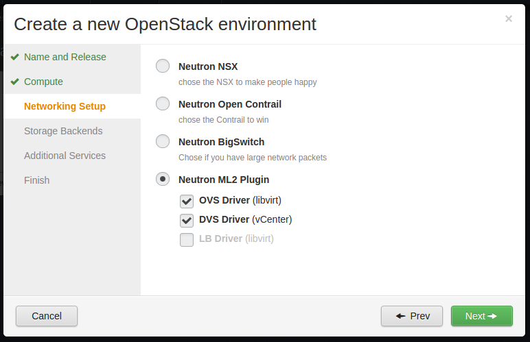

..
 This work is licensed under a Creative Commons Attribution 3.0 Unported
 License.

 http://creativecommons.org/licenses/by/3.0/legalcode

===========================
Fuel multiple HV networking
===========================

https://blueprints.launchpad.net/fuel/+spec/fuel-multiple-hv-networking

Allow a user to choose in the Fuel UI wizard multiple hypervisors and a
suitable Neutron plugin for them. Also allow Fuel plugins to extend HV and
Neutron plugins options in the wizard.

--------------------
Problem description
--------------------

We are going to get rid of supporting Nova-Network in Fuel next versions
making Neutron the only option [0]_.

Also the developing of the Contrail plugin for Fuel 7.0 reveals that our plugin
framework doesn't support a clear notification of which Neutron plugin or ML2
driver will be used in a cloud. In 7.0 it looks like "create a cluster with
strictly Neutron VLAN, then enable our Fuel plugin, it will deploy the cluster
with Contrail enabled but everywhere in Fuel the cluster will be mentioned as
OpenVSwitch + VLANs."

The situation with different hypervisors looks the same way. The Fuel wizard
allows a user to switch a libvirt operation mode between KVM or Qemu and
enable/disable VMware vCenter support. It looks quite complicated and unclear
and forces people make mistakes. Also a plugin is not allowed to add other HV
types into the wizard or the Settings tab.

----------------
Proposed changes
----------------

- Allow Fuel plugins to mix their options into the Compute pane like it's done
  now for the Setting tab.
- Fuel Plugins should be allowed to add monolithic options or ML2
  drivers.
- Each HV option provides its HV type, like "libvirt" or "vmware". Each
  Neutron monolithic plugin or ML2 driver reports HV types it's able to
  support. A user choose one or more HVs first and then select a suitable
  network backend. The wizard may hide/disable inappropriate Neutron
  options based on selected HVs.
- Fuel Puppet manifests should respect new fields with a list of HVs enabled
  and a chosen Neutron backend. To do this best we need to make deploy tasks
  more isolated and independent. But this isolation improvement may wait till
  the next release.

Since we will have "roles from plugins" and a single graph for all tasks
with task override [3]_ a Fuel plugin may fairly easy alternate Neutron
and Nova-compute configurations to add a new HV or network backend.

This is how the new wizard may look like:

Web UI
======

- Move the Qemu/KVM switch to the Settings tab because it's not the HV from
  the OSt stand point. It's just a libvirt setting.
- Redesign the Compute wizard pane to support multiple selections of HVs.
- Redesign the Network wizard pane to support radio buttons for monolithic
  Neutron plugins [1]_ and multiple selections for ML2 drivers [2]_.
- A user is allowed to select one of the monolithic Neutron plugins or, in
  case he chose ML2 plugin, he is able to select one or more ML2 drivers. The
  "Next" button will be blocked until a set of chosen ML2 dirvers may cover
  all HVs selected on the previous step.

Nailgun
=======

Data model
----------

- A new JSON field 'hypervisor_list' should be added into the Cluster model.
  It will be a JSONized list of strings of HV types enabled for cluster.
- The field 'net_l23_provider' in the NeutronConfig model should mean a
  Neutron monolithic plugin used for a cluster.
- A new JSON field 'ml2_drivers' should be added into the NeutronConfig model.
  It will be a JSONized list of strings of ML2 drivers enabled for a cluster.
- A New bind operator ".!add" should be added into the UI DSL. For instance:

  ::

    mycheckbox:
      type: checkbox
      bind:
        - "cluster:hypervisor_list.!add": "libvirt"

  When a checkbox is selected it adds a string "libvirt" into the list
  "cluster:hypervisor_list" if there is no such string in it.
  When a checkbox is unselected it removes all strings "libvirt" from the
  list. So it acts more like a set rather than a list.
- New condition operators "[list1] all in [list2]" and "[list1] any in [list2]"
  should be added into the UI DSL. They check if all/any item from the list1
  are/is in the list2.
- The Network and Compute wizard panes' descriptions should be reworked.
  This is an example how they may look like:

  .. code:: yaml

    Compute:
      libvirt:
        type: "checkbox"
        weight: 5
        bind:
          - "cluster:hypervisor_list.!add": "libvirt"
          - "wizard:Storage.ceph": "disable"
        label: "dialog.create_cluster_wizard.compute.kvm"
        description: "dialog.create_cluster_wizard.compute.kvm_description"
      vcenter:
        type: "checkbox"
        weight: 10
        label: "dialog.create_cluster_wizard.compute.vcenter"
        description: "dialog.create_cluster_wizard.compute.vcenter_description"
        bind:
          - "cluster:hypervisor_list.!add": "libvirt"
          - "wizard:Storage.ceph": "disable"
    Network:
      neutron_plugin:
        type: "radio"
        value: ml2
        bind: "cluster:net_l23_provider"
        values:
          - data: ml2
            label: "Neutron ML2 plugin"
            description: "Lorem ipsum dolor sit amet"
      ml2_drivers:
          openvswitch:
            type: checkbox
            weight: 5
            value: true
            label: "OpenVSwitch driver"
            description: "Required for controllers and must be always enabled"
            restrictions:
              - "1 == 0"
            bind:
              - "cluster:ml2_drivers.!add": "openvswitch"
          vmware_dvs:
            type: checkbox
            weight: 10
            label: "VMware vCenter Distributed vSwitch driver"
            description: "Required for VMware vCenter"
            bind:
              - "cluster:ml2_drivers.!add": "vmware_dvs"
            restrictions:
              - "not (cluster:hypervisor_list any in ['vmware'])"

REST API
--------

/api/releases Nailgun API is affected, will return a wizard metadata with mixed
parts from plugins.

Orchestration
=============

None.

RPC Protocol
------------

None.

Fuel Client
===========

CLI should support a listing of available HVs and network backends and
relationships between them.

Plugins
=======

Plugins can add new network backends and hypervisors. This information will be
taken from environment_config.yaml. A new section "wizard" should be added for
this.

.. code:: yaml

  wizard:
    Compute:
      xen:
        type: "checkbox"
        weight: 15
        bind:
          - "cluster:hypervisor_list.!add": "xen"
        label: "XEN server"
        description: "lorem ipsum dolor sit amet"
    Network:
      neutron_plugin:
        values:
          - data: contrail
            label: "Contrail neutron plugin"
            description: "Supports libvirt only"
            restrictions:
              - "not (cluster:hypervisor_list all in ['libvirt'])"
      ml2_drivers:
        baremetal:
          type: checkbox
          label: "Baremetal driver"
          description: "Required for Ironic"
          bind:
            - "cluster:ml2_drivers.!add": "baremetal"
          restrictions:
            - "not (cluster:hypervisor_list any in ['ironic'])"

Fuel Library
============

- Fuel Puppet manifests should respect new fields with a list of HVs enabled
  and a chosen Neutron backend. To do this best we need to make deploy tasks
  more isolated and independent. But this isolation improvement may wait till
  the next release.

------------
Alternatives
------------

TBD

--------------
Upgrade impact
--------------

None.

---------------
Security impact
---------------

None.

--------------------
Notifications impact
--------------------

None.

---------------
End user impact
---------------

End user will see the new wizard's Compute and Network panes in Fuel UI.
CLI should support a listing of available HVs and network backends and
relationships netween them.

------------------
Performance impact
------------------

None.

-----------------
Deployment impact
-----------------

None.

----------------
Developer impact
----------------

None.

--------------------------------
Infrastructure/operations impact
--------------------------------

None.

--------------------
Documentation impact
--------------------

Fuel Users Guide should be updated. Create the environment creation wizard
section.

--------------------
Expected OSCI impact
--------------------

None.

--------------
Implementation
--------------

Assignee(s)
===========

======================= =============================================
Primary assignee        Alexander Arzhanov <aarzhanov@mirantis.com>
Developers              Anton Zemlyanov <azemlyanov@mirantis.com>
                        Andriy Popovych <apopovych@mirantis.com>
QA engineers            Ruslan Khozinov <rkhozinov@mirantis.com>
Mandatory design review Igor Zinovik <izinovik@mirantis.com>
                        Aleksey Kasatkin <akasatkin@mirantis.com>
                        Igor Kalnitsky <ikalnitsky@mirantis.com>
                        Vitaly Kramskikh <vkramskikh@mirantis.com>
======================= =============================================

Work Items
==========

- update wizard's Compute Pane to use checkboxes.
- update wizard's Network Pane to use Neutron and ML2 drivers.
- introduce a merge mechanism in Naigun /api/releases handler.
- add necessary actions into Fuel CLI.

Dependencies
============

Role as a plugin [3]_.

------------
Testing, QA
------------

- manual testing.
- UI wizard functional tests update.

Acceptance criteria
===================

- A user should be able to select one or more hypervisors (check-boxes instead
  of radio buttons)
- A user should be able to map multiple hypervisors to one or more networking
  underlays in the wizard

----------
References
----------

.. [0] https://bugs.launchpad.net/fuel/+bug/1446322
.. [1] https://wiki.openstack.org/wiki/Neutron_Plugins_and_Drivers
.. [2] https://wiki.openstack.org/wiki/Neutron/ML2
.. [3] https://blueprints.launchpad.net/fuel/+spec/role-as-a-plugin
