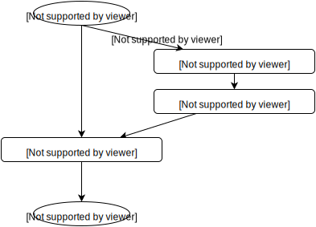
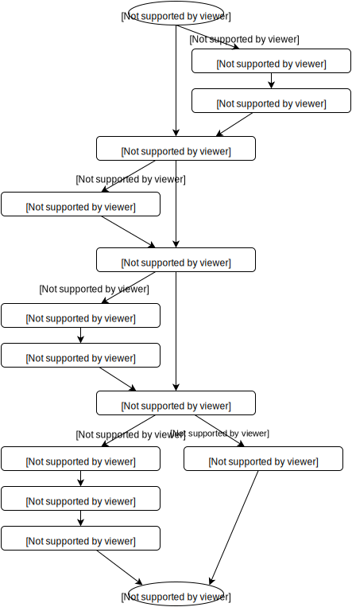

..
 This work is licensed under a Creative Commons Attribution 3.0 Unported
 License.

 http://creativecommons.org/licenses/by/3.0/legalcode

==========================================
Make Neutron deployment task more granular
==========================================

https://blueprints.launchpad.net/fuel/+spec/make-neutron-deployment-task-more-granular

Guys, who make network plugins for Fuel has many inconviences if changes to
deployment process of Neutron required.

--------------------
Problem description
--------------------

Usually network plugins for Fuel made by one design scheme:

* in the pre-deployment task:

  * install required packages

* deploy cluster with most convenient for plugin configuration
* in the post-deployment task:

  * install or replace plugin-specific packets
  * try to re-configure already configured stuff

This approach looks non-optimal for all cases. For some cases re-configuration
is impossible. For such cases all already deployed Neutron related stuff should
be removed and re-deployed by plugin.

Since 7.0 release fuel plugins got ability to make change into deployment
graph. Insert his own tasks and replace existing tasks now possible.

But Fuel has Monolith (one-task based) Neutron granula. I.e. plugin has no
ability for change deployment graph for Neutron.

This blueprint provided required changes to deployment graph. Monolith Neutron
task should be separated to set of small tasks.
One task per one logically isolated job .

Proposed approach should greatly facilitate the process of network plugins
development.

----------------
Proposed changes
----------------

Current deployment graph for network part looks like:

Proposed graph for network part should be:

Fuel Library
============

Are following changes required to Fuel Library puppet manifests:

* Our upstream Neutron wrapper Openstack::Network::* manifest
  should be refactored
* Code from one should be moved to corresponded granulas
* Manifests Openstack::Network, Openstack::Network::Create_network
  Openstack::Network::Create_router, Openstack::Network::Neutron_agents
  should be removed, because all functionality implemented in granulas.

Plugins
=======

Plugin developers should take into account changes of deploing graph.

Web UI
======
None

Nailgun
=======

Data model
----------
None

REST API
--------
None

Orchestration
=============

RPC Protocol
------------
None

Fuel Client
===========
None

------------
Alternatives
------------

Leave all as is.

--------------
Upgrade impact
--------------

None

---------------
Security impact
---------------

None

--------------------
Notifications impact
--------------------

None

---------------
End user impact
---------------

None

------------------
Performance impact
------------------

None

-----------------
Deployment impact
-----------------

None

----------------
Developer impact
----------------

None

--------------------------------
Infrastructure/operations impact
--------------------------------

None

--------------------
Documentation impact
--------------------

None

--------------------
Expected OSCI impact
--------------------

None

--------------
Implementation
--------------

None

Work Items
==========

* re-write some granulas (puppet manifests) into osnailyfacter module
* modify deployment graph

Assignee(s)
===========

Feature Lead: Sergey Vasilenko
Mandatory Igor Zinovik
Developers: Dmitry Iliyi
QA: Anastasiia Urlapova

Dependencies
============

None

------------
Testing, QA
------------

No changes. All existing tests should be used.

Acceptance criteria
===================

Acceptance criteria does not different from one for ordinary bugfixes to
fuel-library. Standart BVT should be passedfor following configurations:

* Nova-network deployment (all provided cases)
* Neutron/vlan
* Neutron/vxlan
* Vcenter

----------
References
----------

1. LP blueprint https://blueprints.launchpad.net/fuel/+spec/make-neutron-deployment-task-more-granular

