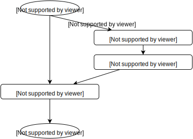
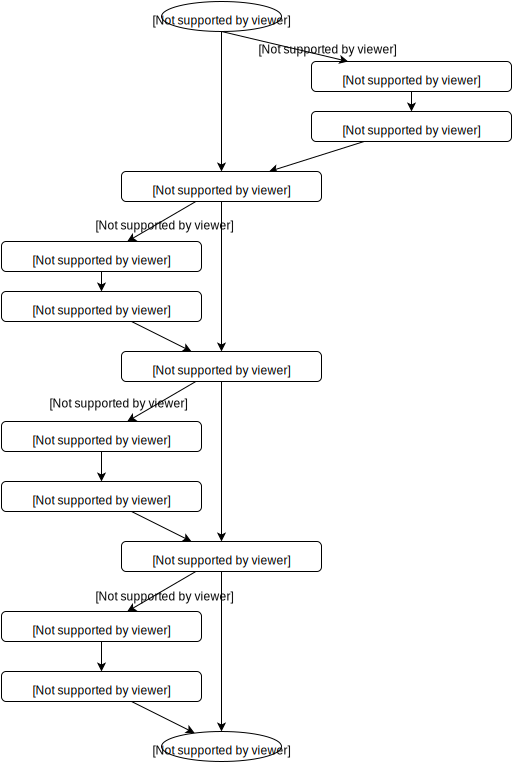

..
 This work is licensed under a Creative Commons Attribution 3.0 Unported
 License.

 http://creativecommons.org/licenses/by/3.0/legalcode

==========================================
Make Neutron deployment task more granular
==========================================

https://blueprints.launchpad.net/fuel/+spec/make-neutron-deployment-task-more-granular

Guys, who make network plugins for Fuel has many inconviences if changes to
deployment process of Neutron required.

--------------------
Problem description
--------------------

Usually network plugins for Fuel made by one design scheme:

* in the pre-deployment task:

  * install required packages

* deploy cluster with most convenient for plugin configuration
* in the post-deployment task:

  * install or replace plugin-specific packets
  * try to re-configure already configured stuff

This approach looks non-optimal for all cases. For some cases re-configuration
is impossible. For such cases all already deployed Neutron related stuff should
be removed and re-deployed by plugin.

Since 7.0 release fuel plugins got ability to make change into deployment graph.
Insert his own tasks and replace existing tasks now possible.

But Fuel has Monolith (one-task based) Neutron granula. I.e. plugin has no
ability for change deployment graph for Neutron.

In this blueprint I describe how to separate monolith Neutron implementation
to set of small tasks. One task per one logically isolated job .

Proposed approach should greatly facilitate the process of network plugins
development.

----------------
Proposed changes
----------------

Current deployment graph for network part looks like:

Proposed graph for network part should be:

------------
Alternatives
------------

Leave all as is.

--------------
Upgrade impact
--------------

None

---------------
Security impact
---------------

None

--------------------
Notifications impact
--------------------

None

---------------
End user impact
---------------

None

------------------
Performance impact
------------------

None

-----------------
Deployment impact
-----------------

None

----------------
Developer impact
----------------

None

--------------------------------
Infrastructure/operations impact
--------------------------------

None

--------------------
Documentation impact
--------------------

None

--------------------
Expected OSCI impact
--------------------

None

--------------
Implementation
--------------

None

Work Items
==========

* re-write some granulas (puppet manifests) into osnailyfacter module
* modify deployment graf

Dependencies
============

None

------------
Testing, QA
------------

No changes. All existing tests should be used.

Acceptance criteria
===================

Standart BVT should be passed.

----------
References
----------

1. LP blueprint https://blueprints.launchpad.net/fuel/+spec/make-neutron-deployment-task-more-granular

