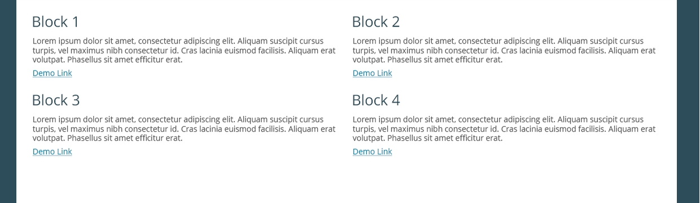

..
 This work is licensed under a Creative Commons Attribution 3.0 Unported
 License.

 http://creativecommons.org/licenses/by/3.0/legalcode

========================================================
Support for external dashboard plugin entries in Fuel UI
========================================================

https://blueprints.launchpad.net/fuel/+spec/support-for-dashboard-plugin-entries-in-ui

Extend existing OpenStack environment Dashboard tab with entry points for
plugins giving them an ability to provide urls for post-deployment OpenStack
environment manipulation.

--------------------
Problem description
--------------------

There are no links for installed plugins in Fuel UI, so the user cannot find
out more information about installed plugins/

----------------
Proposed changes
----------------

Web UI
======

The plugins will have a possibility to create their own dashboard entries by
providing plugin url, title and description. Urls, titles and descriptions,
provided by plugins (services like Murano, Sahara, Ceilometer are treated as
plugins also) via API described in corresponding chapter `REST API`_ will
appear at the bottom of the Dashboard tab of the cluster with these plugins
enabled.
Plugin entries will be sorted by 'id' attribute.

Nailgun
=======

Provide API with links to all possible necessary resources after OpenStack
environment deployment.

* link to Zabbix
* link to Murano (description and what to do with it)
* link to Sahara (description and what to do with it)
* link to Ceilometer (description and what to do with it)
* any other links provided by plugins

The special `/cluster/:id/dashboard_entries` url will be available, by GETting
which it will be possible to get the list of dashboard entries.

To solve authentication issues there will be used auth exemption.

Data model
----------

The new table for dashboard entries should be created, containing the
following fields:

+----+--------+-------------+--------+------------+
| id | title  | description | url    | cluster_id |
+====+========+=============+========+============+
| id | String | String      | String | id         |
+-------------+-------------+--------+------------+

cluster_id field means one cluster may have many dashboard entries for plugin,
but it will belong to one cluster (one-to-many relationship).

REST API
--------

API GET, POST, PUT and DELETE methods should be available for plugins in their
post-deployment hooks.

[TBD] - POST and PUT data format to be clarified

[TBD] - validation cases for the data what status codes and responses will be
returned by API in case of invalid data

There will be a new REST API url added:

+--------+--------------------------------+--------------------------+-------+
| method | URL                            | action                   | auth  |
|        |                                |                          | exempt|
+========+================================+==========================+=======+
|  POST  | /api/v1/clusters/:cluster_id/  | create a new  item       | true  |
|        | dashboard_entries              | for dashboard entries    |       |
+--------+--------------------------------+--------------------------+-------+
|  GET   | /api/v1/clusters/:cluster_id/  |  get a list of           | false |
|        | dashboard_entries              |   dashboard entries      |       |
+--------+--------------------------------+--------------------------+-------+
|  PUT   | /api/v1/clusters/:cluster_id/  | update a dashboard entry | false |
|        | dashboard_entries/:entry_id    |  with specified id       |       |
+--------+--------------------------------+--------------------------+-------+
| DELETE | /api/v1/clusters/:cluster_id/  | delete a dashboard       | false |
|        | dashboard_entries/:entry_id    | entry with specified id  |       |
+--------+--------------------------------+--------------------------+-------+

GET returns JSON like this:

.. code-block:: json

    [
        {
            title: 'Zabbix',
            description: 'Zabbix is software that monitors numerous' +
            + 'parameters of a network and the health and integrity' +
            + ' of servers',
            url: 'http://www.zabbix.com/',
            id: Number(identificator)
        },
        {
            title: 'Murano',
            url: 'https://wiki.openstack.org/wiki/Murano',
            id: Number(identificator)
        },
        {
            title: 'My plugin',
            description: 'My awesome plugin',
            url: '/my_plugin',
            id: Number(identificator)
        }
    ]

Orchestration
=============

None.

RPC Protocol
------------

None.

Fuel Client
===========

None.

Plugins
=======

Will provide an entry point for plugins to access post-deployment
dashboard.

Fuel Library
============

None.

------------
Alternatives
------------

None.

--------------
Upgrade impact
--------------

A migration should be created for DashboardEntries table, also
migrations are needed to generate dashboard entries for old OpenStack
environments - for Sahara and Murano entries.

---------------
Security impact
---------------

None.

--------------------
Notifications impact
--------------------

None.

---------------
End user impact
---------------

Ability to access plugins urls will be provided.

------------------
Performance impact
------------------

None.

-----------------
Deployment impact
-----------------

None.

----------------
Developer impact
----------------

None.

--------------------------------
Infrastructure impact
--------------------------------

None.

--------------------
Documentation impact
--------------------

The change should be reflected in both plugin documentation and user guide.

--------------------
Expected OSCI impact
--------------------

None.

--------------
Implementation
--------------

Assignee(s)
===========

Primary assignee:
  Alexandra Morozova, astepanchuk (astepanchuk@mirantis.com)

Other contributors:
  Vladimir Sharshov, vsharshov (vsharshov@mirantis.com)
  Bogdan Dudko, bdudko (bdudko@mirantis.com)

QA engineer:
  Anastasia Palkina, apalkina (apalkina@mirantis.com)

Mandatory design review:
  Vitaly Kramskikh, vkramskikh (vkramskikh@mirantis.com)
  [tbd] - add appropriate Pyton core reviewer

Work Items
==========

#. Backend support for dashboard plugin entries.
#. Implement UI logic.

Dependencies
============

None.

------------
Testing, QA
------------

* Tests to be created for new REST API items.
* UI side of Dashboard implementation should also be covered with
  functional and unit tests - React components, new UX, new js model.
* DB migrations should be tested.
* JSON schema should be added.
* Manual testing.

Acceptance criteria
===================

User can access plugin urls and descriptions after OpenStack Environment
deployment from the OpenStack environment dashboard in Fuel UI.

----------
References
----------

* #fuel-ui on freenode
