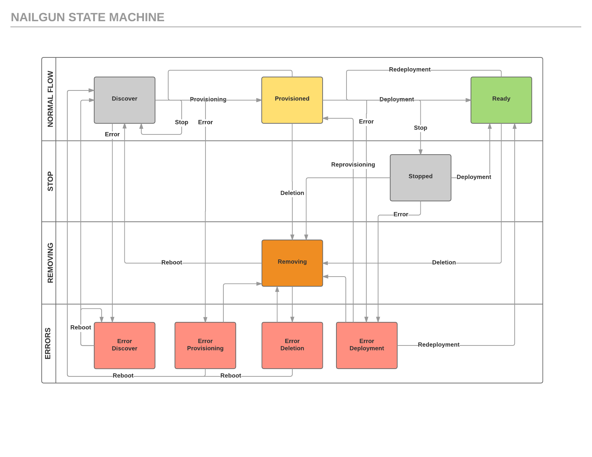

..
 This work is licensed under a Creative Commons Attribution 3.0 Unported
 License.

 http://creativecommons.org/licenses/by/3.0/legalcode

======================================================
Allow a User to Stop Deployment and Further Restart It
======================================================

Include the URL of your launchpad blueprint:

https://blueprints.launchpad.net/fuel/+spec/graceful-stop-restart-deployment

As an operator I want to be able to stop the deployment process and restart
it so that I can change erroneous configuration or fix environmental or
infrastructural issues whichever arise and start the deployment again.

Examples are:

    * Some nodes failed during OS provisioning due to some floating bug or
      even some unknown reason

    * Some nodes gone offline during the deployment due to intermittent
      connectivity issue

    * Operator discovers that he needs to adjust or correct
      cluster settings, networks, plugins, enabled services, etc.

For all cases of such kind the following UX must be made available:

    * User faces a case when cloud deployment needs to be stopped and some
      additional measures taken to assure it's further success

    * User presses "Stop deployment" button in the UI

    * User applies changes required to prevent the failure - fixes the servers,
      makes changes to deployment config parameters, etc

    * User presses "Deploy Changes" button

    Fuel proceeds with the deployment, taking into consideration particular
    stage of the deployment that the cluster has reached already (OS
    provisioned), with all tasks being re-ran on the corresponding nodes

--------------------
Problem description
--------------------

Currently Fuel has a really buggy implementation of "Stop Deployment"
functionality which actually resets the cluster and breaks real life-cycle
management scenarios because if you stop the deployment during compute
addition this will actually destroy the cluster completely. With task-based
deployment and tasks history feature implementation it should be relatively
easy.

----------------
Proposed changes
----------------

New node status 'stopped' is going to be introduced as well as a composite
cluster status 'partially_deployed' is going to be introduced. Graceful
cluster stop will send a signal to the orchestrator to inform it to stop
further deployment graph traversal and report corresponding statuses.

Its place in current cluster and nodes state machine is described here:

Web UI
======

Status stopped should be supported on UI side

Nailgun
=======

New node status 'stopped' is going to be introduced. Also, Nailgun rpc
receiver is going to be altered to support 'stopped' task status.

Data model
----------

None

REST API
--------

None

Orchestration
=============

Orchestrator will support new status 'stopped' for the nodes, will wait for
particular deployment engine to finish its execution on all the running nodes
and report the status back to Nailgun. Instead of classic stop deployment now
orchestrator stop to process new tasks, but allow to end already running tasks.

RPC Protocol
------------

RPC receiver in Nailgun and Astute should support 'stop deployment' signal

Fuel Client
===========

None

Plugins
=======

None

Fuel Library
============

None

------------
Alternatives
------------

None

--------------
Upgrade impact
--------------

Supported only by 9.0 clusters.

---------------
Security impact
---------------

None

--------------------
Notifications impact
--------------------

None

---------------
End user impact
---------------

Ability to stop the cluster without ruining it

------------------
Performance impact
------------------

None

-----------------
Deployment impact
-----------------

None

----------------
Developer impact
----------------

The same as user's - ability to stop things, change something and start thus
increasing development velocity.

---------------------
Infrastructure impact
---------------------

None

--------------------
Documentation impact
--------------------

"Stop Deployment" action documentation should be updated

--------------
Implementation
--------------

Assignee(s)
===========

Primary assignee:
  vsharshov

Other contributors:
  bgaifullin
  jkirnosova

Mandatory design review:
  ikalnitsky
  rustyrobot

Work Items
==========

* UI support of stopped status should be introduced

* Astute should be extended with support of 'stop_deployment' action

* Nailgun should extend node status and cluster status set

Dependencies
============

Related to deployment tasks history feature [0]

------------
Testing, QA
------------

We need to cover the new Stop/Restart behavior by the test cases
according to acceptance criteria

Acceptance criteria
===================

Deployment of the cluster should simply wait for exit of particular
deployment tasks executors and report back to Nailgun. User should be able
to successfully restart by running regular cluster actions which should
not fail to any possible artifacts introduced by deployment stop action.

----------
References
----------

[0] https://blueprints.launchpad.net/fuel/+spec/store-deployment-tasks-history

