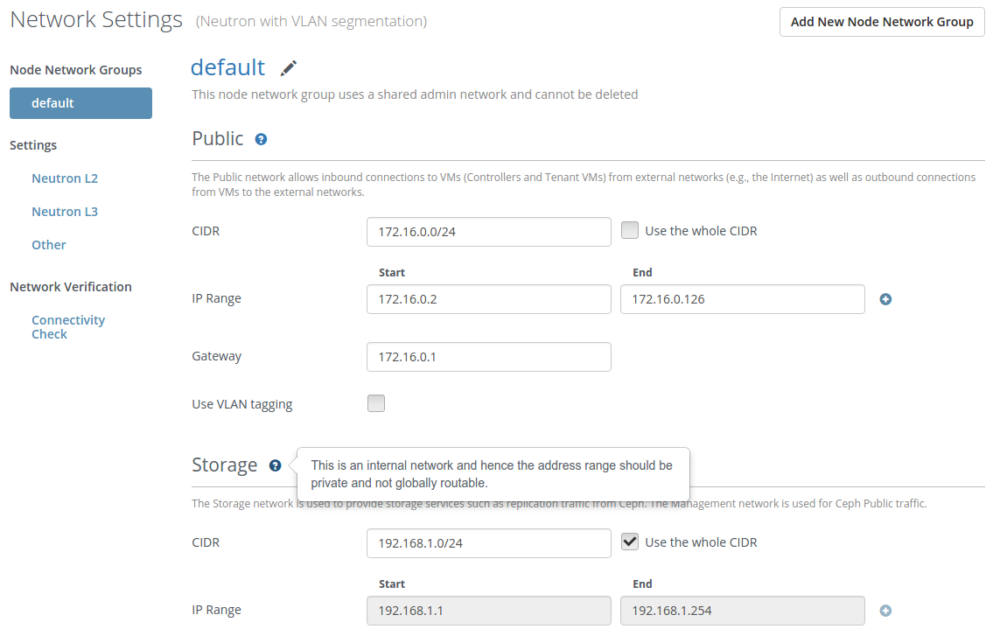

..
 This work is licensed under a Creative Commons Attribution 3.0 Unported
 License.

 http://creativecommons.org/licenses/by/3.0/legalcode

=================================
Networking extended help popovers
=================================

https://blueprints.launchpad.net/fuel/+spec/network-requirements-popup

All networks on the Network tab should be accompanied by list of requirements
and/or instructions how to set up the network settings properly.

--------------------
Problem description
--------------------

Networks tab contains many settings for many networks and this is not simple
UX for the End User.

Networking help popovers need to show all restrictions or requirements for
networks to help End User to correctly set up network setting values.

----------------
Proposed changes
----------------

Web UI
======

There will be new info icons near network titles on the Network Settings
tab, if End User mouse hover on it, additional information about the
requirements will be shown in the popover. These icons are visible
in all cases, even if tab is locked.

The following mockup contains a design how this popover will look like:

Nailgun
=======

No changes required.

Data model
----------

None.

REST API
--------

None.

Orchestration
=============

No changes required.

RPC Protocol
------------

None.

Fuel Client
===========

No changes required.

Plugins
=======

No changes required.

Fuel Library
============

No changes required.

------------
Alternatives
------------

None.

--------------
Upgrade impact
--------------

None.

---------------
Security impact
---------------

None.

--------------------
Notifications impact
--------------------

None.

---------------
End user impact
---------------

There is Fuel UI change only.

------------------
Performance impact
------------------

None.

-----------------
Deployment impact
-----------------

None.

----------------
Developer impact
----------------

Network settings developer should provide such instructions for the new
network or add new requirements to an existing network.

---------------------
Infrastructure impact
---------------------

None.

--------------------
Documentation impact
--------------------

The user guide should be updated according the described feature.

--------------
Implementation
--------------

Assignee(s)
===========

Primary assignee:
  kpimenova (kpimenova@mirantis.com)

Other contributors:
  bdudko (bdudko@mirantis.com) - visual design

Mandatory design review:
  vkramskikh (vkramskikh@mirantis.com)

Work Items
==========

#. Visual mockups creation.
#. JavaScript development of the feature.

Dependencies
============

None.

------------
Testing, QA
------------

Functional tests should be added to check popovers are shown on UI and
contain data.

Acceptance criteria
===================

* In case if network has a list of restrictions or requirements, they should
  be shown on Network settings tab.

----------
References
----------

#fuel-ui on freenode
