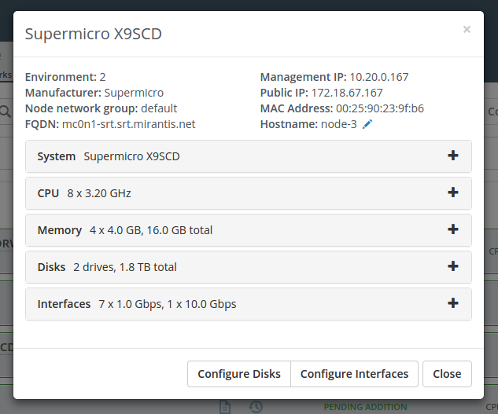

..
 This work is licensed under a Creative Commons Attribution 3.0 Unported
 License.

 http://creativecommons.org/licenses/by/3.0/legalcode

===============================
Display node IP addresses in UI
===============================

https://blueprints.launchpad.net/fuel/+spec/node-display-ip-address

Display node public and management IP addresses in node details pop-up.

--------------------
Problem description
--------------------

Currently, we have an ability to see node public and management IP just from
interfaces list in node details pop-up. It would be good to make this
information more accessible to End User.

----------------
Proposed changes
----------------

Web UI
======

There will be new "Management IP" and "Public IP" fields in the summary section
of node details pop-up. They will be hidden for unallocated nodes. IP addresses
on undeployed node will have N/A values in most cases, but after deployment
starts all networks should have IP.

The following mockup shows how these fields will look like:

Nailgun
=======

No changes required.

Data model
----------

None.

REST API
--------

None.

Orchestration
=============

No changes required.

RPC Protocol
------------

None.

Fuel Client
===========

No changes required.

Plugins
=======

No changes required.

Fuel Library
============

No changes required.

------------
Alternatives
------------

None.

--------------
Upgrade impact
--------------

None.

---------------
Security impact
---------------

None.

--------------------
Notifications impact
--------------------

None.

---------------
End user impact
---------------

There is Fuel UI change only.

------------------
Performance impact
------------------

None.

-----------------
Deployment impact
-----------------

None.

----------------
Developer impact
----------------

None.

---------------------
Infrastructure impact
---------------------

None.

--------------------
Documentation impact
--------------------

The user guide should be updated according to the described feature.

--------------
Implementation
--------------

Assignee(s)
===========

Primary assignee:
  kpimenova (kpimenova@mirantis.com)

Other contributors:
  bdudko (bdudko@mirantis.com) - visual design

Mandatory design review:
  vkramskikh (vkramskikh@mirantis.com)

Work Items
==========

#. Visual mockups creation.
#. JavaScript development of the feature.

Dependencies
============

None.

------------
Testing, QA
------------

Functional tests should be added to check public and management IP addresses
are shown on UI.

Acceptance criteria
===================

* Public and management IP addresses should be shown on UI.

----------
References
----------

#fuel-ui on freenode