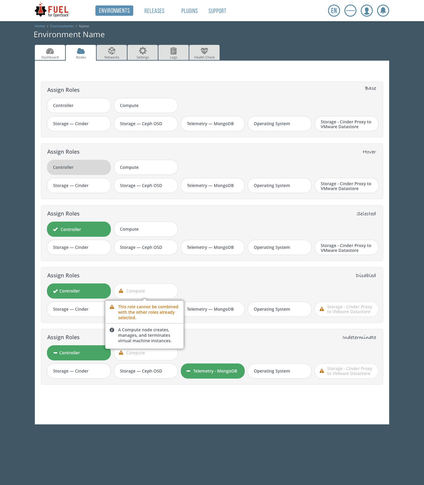

..
 This work is licensed under a Creative Commons Attribution 3.0 Unported
 License.

 http://creativecommons.org/licenses/by/3.0/legalcode

============================
Redesign of node roles panel
============================

https://blueprints.launchpad.net/fuel/+spec/redesign-of-node-roles-panel

Visual redesign of node roles panel in Fuel UI without changing its
functionality.

--------------------
Problem description
--------------------

Currently, node roles panel takes a big part of Add Nodes and Edit Roles
screens. User has to scroll down to node list to check nodes and then
scroll up again to check roles. This becomes more actual for desktops with
a small screen.

We also need to take into account plugins that can add their own roles, so it
can be a large list of node roles on the screen.

----------------
Proposed changes
----------------

A suggestion is to redesign the panel to improve UX of node addition and role
assignment.

Web UI
======

The following mockup contains a new visual design for different role statuses:

* unselected
* hovered
* selected
* disabled because of conflicts/limitations
* indeterminated (if not all nodes from the node list have the role assigned)

Role becomes selected by clicking on its container.

Role description and warning are shown in a popover, which appears after
hovering over the role container with a slight delay.

The new role list should be grouped by a new role meta attribute `group`:

* group 'BASE'

  * controller
  * detach-* plugin roles

* group 'COMPUTE'

  * compute
  * virt
  * compute-vmware
  * ironic

* group 'STORAGE'

  * cinder
  * cinder-block-device
  * cinder-vmware
  * ceph-osd

* group 'OTHER'

  * base-os
  * mongo
  * zabbix
  * murano (it is going to be moved to plugin)

.. image:: ../../images/9.0/redesign-of-node-roles-panel/role-list-grouping.png

Nailgun
=======

Data model
----------

New `group` property should be added to metadata attribute of Role model.
The new property can have one of the following values:

* 'base'
* 'compute'
* 'storage'
* 'other'

Roles without `group` metadata specified or with other value of
the attribute will automatically go to 'other' group in Fuel UI.

REST API
--------

JSON schema of a role model should be updated to describe the new `group`
field in role metadata.

Orchestration
=============

No changes required.

RPC Protocol
------------

No changes required.

Fuel Client
===========

No changes required.

Plugins
=======

Plugin node role template should be updated in v5 plugin builder version
to include the new `group` role attribute with a default 'other' value.

Fuel Library
============

No changes required.

------------
Alternatives
------------

The new role list can also be grouped by role 'limits' metadata to
the following groups:

* required and recommended roles for deployment (a role has 'min' or
  'recommended' limit)
* optional roles for deployment (a role has no 'min' or
  'recommended' limit specified)
* unavailable roles (locked for addition because of some restrictions;
  for example, mongo role is unavailable when Ceilometer service is not
  enabled in environment settings)

But the chosen grouping will also help to organize roles into groups
to calculate environment capacity properly [1]: it does not make sense
to count CPU and RAM of non-compute nodes or HDD of non-storage nodes.

--------------
Upgrade impact
--------------

Since there is a data model impact, an appropriate Alembic migration should be
prepared to add `group` metadata to existing roles (particular role `group`
attribute values are described in `Web UI`_ section).

---------------
Security impact
---------------

None.

--------------------
Notifications impact
--------------------

None.

---------------
End user impact
---------------

No other impact.

------------------
Performance impact
------------------

None.

-----------------
Deployment impact
-----------------

None.

----------------
Developer impact
----------------

Fuel developer will be able to assign a new role to some group to highlight
the role purpose in the cloud and/or deployment process.

---------------------
Infrastructure impact
---------------------

None.

--------------------
Documentation impact
--------------------

* Screenshots of node roles panel should be updated in the user guide.
* Development documentation should be also updated to describe a new role
  `group` metadata.

--------------
Implementation
--------------

Assignee(s)
===========

Primary assignee:
  jkirnosova (jkirnosova@mirantis.com)

Other contributors:
  bdudko (bdudko@mirantis.com) - visual design

Mandatory design review:
  vkramskikh (vkramskikh@mirantis.com)
  ikalnitsky (ikalnitsky@mirantis.com)

Work Items
==========

#. Visual mockups creation.
#. JavaScript development of the feature.
#. Nailgun changes to support a new role `group` metadata.

Dependencies
============

None.

------------
Testing, QA
------------

* New role panel view should be covered by automated UI functional tests.
* Test for the Alembic migration should be prepared.

Acceptance criteria
===================

* New role list takes up less space on a screen.
* New role panel keeps functionality of the initial panel version:

  * contains all role data (name, description)
  * displays role conflicts and limitations
  * each role is selectable.

* Roles a grouped by their `group` meta attribute.

----------
References
----------

[1] https://bugs.launchpad.net/fuel/+bug/1375750
[2] #fuel-ui on freenode
