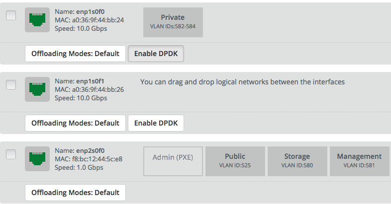
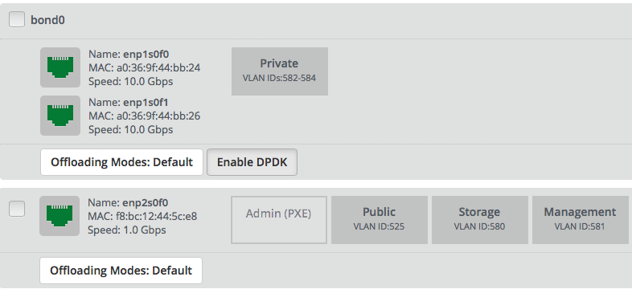

..
 This work is licensed under a Creative Commons Attribution 3.0 Unported
 License.

 http://creativecommons.org/licenses/by/3.0/legalcode

================
Support for DPDK
================

https://blueprints.launchpad.net/fuel/+spec/support-dpdk

In order to get as close to wire-line speed as possible for virtual machines,
we want to install and utilize OVS with DPDK on some compute nodes.

--------------------
Problem description
--------------------

DPDK-backed OpenVSwitch and vhostuser features are fully merged in OpenStack
Mitaka. With this set of features operator could achieve a boost to the
networking performance, and unlike SR-IOV, operator can still control traffic
via OpenFlow rules.

----------------
Proposed changes
----------------

Enabling DPDK requires:

* Discovering compatible hardware by hardcoded compatible driver and model
  list, that extracted from DPDK website and drivers source code and hardcoded
  into Fuel settings.

* Providing operator with information about compatible NICs.

* Proper network configuration with dedicated Private network for VLAN
  segmentation.

* Configuring CPU isolation for OVS and DPDK PMD.

* Configuring memory amount for DPDK for every NUMA node.

* Making configurations on compute side, including nova, neutron, interface
  binding to the DPDK and OpenVSwitch.

Web UI
======

On Nodes tab, in Interfaces configuration screen for every interface or bond
should be checkbutton to enable DPDK on network interface. It will be shown
only if interface is DPDK-capable:

For bond, it will be shown only if all bonded interfaces are DPDK-capable:

Only Private network with VLAN segmentation could be placed on DPDK enabled
interface or bond.

If no networks is placed on DPDK interface, that means that no changes should
be done in deployment.

These validations should be done both on UI and in API.

Nailgun
=======

The nailgun-agent should collect and send information information about
PCI-ID of NIC. This information should be passed to nailgun in the next
format

.. code-block:: json

  {
    "meta": {
      "interfaces": [
        {
           "pci_id": String,
           "numa_node": Number
        }
      ]
  }

The nailgun will compare PCI-ID against hardcoded into `openstack.yaml` list of
supported hardware. List of supported hardware should also сontains dpdk driver
name for every PCI-ID, that used in network scheme

::

  dpdk_hw:
    igb_uio: [8086:1010, 8086:1012, ... ]
    <dpdk_driver>: <LIST OF PCI-IDS>

Data model
----------

Next DPDK-related information is stored in `interface_properties` field of
`NodeNICInterface`:

* PCI-ID of interface.

* NUMA node of PCI device.

* Whether DPDK is enabled by user or not.

Availability should be calculated when nailgun receive information from agent.

Data model for `interface_properties` should look like this

.. code-block:: json

  [
     {
        "interface_properties" : {
           "dpdk" : {
              "enabled": Boolean or null,
              "available": Boolean
           },
           "pci_id": String,
           "numa_node": Number
        }
     }
  ]

For bond interface, only `dpdk` dict is needed.

When operator configures interface as DPDK to use it for Private network,
`astute.yaml` will be extended as following

* Node-level parameter `enabled` will enable DPDK in OpenVSwitch on node. Other
  parameters should be defined and provided by HugePages and NUMA/CPU
  pinning features

  * `ovs_core_mask`: OpenVSwitch cpu core mask in hexa format

  * `ovs_pmd_core_mask`: OpenVSwitch core mask in hexa format for PMD threads

  * `ovs_socket_mem`: List of amounts of memory to allocate per NUMA node

  ::

    dpdk:
      enabled: True
      ovs_core_mask: 0x4
      ovs_pmd_core_mask: 0x6
      ovs_socket_mem: 128,128,128,128

* Network transformations should include vendor specific attrubute
  `datapath_type: netdev` to `br-prv` bridge::

    network_scheme:
      transformations:
      - action: add-br
        name: br-prv
        provider: ovs
        vendor_specific:
          datapath_type: netdev

* Interface should be added using `add-port` action with provider `dpdkovs`
  directly into OVS `br-prv` bridge::

    network_scheme:
      transformations:
      - action: add-port
        name: enp1s0f0
        bridge: br-prv
        provider: dpdkovs

* Bond should be added using `add-bond` action with provider `dpdkovs` directly
  into OVS `br-prv` bridge::

    network_scheme:
      transformations:
      - action: add-bond
        bridge: br-prv
        provider: dpdkovs
        bond_properties:
          mode: balance-rr
        interfaces:
        - enp1s0f0
        - enp1s0f1
        name: bond0

* New vendor specific attribute `dpdk_driver` should be added from hardcoded
  list of supported hardware (described above)::

    network_scheme:
     interfaces:
       enp1s0f0:
         vendor_specific:
           bus_info: '0000:01:00.0'
           driver: ixgbe
           dpdk_driver: uio_igb

REST API
--------

Only payload for interfaces and node agent API handlers will be changed as
described in Nailgun-agent and Data model sections.

Orchestration
=============

None

RPC Protocol
------------

Only payload changes.

Fuel Client
===========

User will able to modify DPDK enablement on interface and network assignment
it with `fuel node --network --download/--upload` because of REST API payload
changes. No changes required in client.

Plugins
=======

None

Fuel Library
============

Fuel library will consume data from astute.yaml.

* OpenVSwitch will be configured to use dpdk.

* `vhostuser_socket_dir` will be configured in plugin.ini on compute node to
  enable vhostuser in neutron.

* l23network will configure interface as dpdk, connect it to ovs bridge and
  store it in config.

------------
Alternatives
------------

To achieve the same networking performance SR-IOV could be used. Comparing to
it, DPDK allows to use experimental Security Groups engine.

--------------
Upgrade impact
--------------

None

---------------
Security impact
---------------

None

--------------------
Notifications impact
--------------------

None

---------------
End user impact
---------------

User interface impact is described in Web UI section.

------------------
Performance impact
------------------

Performance penalties are not expected.

-----------------
Deployment impact
-----------------

This feature will require to use VLAN segmentation and dedicated DPDK capable
network interface for Private network.

----------------
Developer impact
----------------

None

---------------------
Infrastructure impact
---------------------

This feature will be tested on virtual environment.

--------------------
Documentation impact
--------------------

TBD

--------------
Implementation
--------------

Assignee(s)
===========

Primary assignee:
  * Vladimir Eremin <veremin@mirantis.com>
  * Sergey Kolekonov <skolekonov@mirantis.com>

Mandatory design review:
  * Sergey Vasilenko <svasilenko@mirantis.com>
  * Dmitry Teselkin <dteselkin@mirantis.com>

Work Items
==========

* Collecting information about interfaces
* Enable DPDK configuration in fuel-library
* Support of configuring DPDK via fuel API
* Support of DPDK on UI
* Manual testing
* Create a system test for DPDK

Dependencies
============

This feature depends on `HugePages
<https://blueprints.launchpad.net/fuel/+spec/support-hugepages>`_ and
`NUMA/CPU pinning
<https://blueprints.launchpad.net/fuel/+spec/support-numa-cpu-pinning>`_
features.

------------
Testing, QA
------------

* Test API/CLI cases for the configuring DPDK
* Test WEB UI cases for the configuring DPDK
* Test that DPDK is discovered and configured properly
* Performance testing

Acceptance criteria
===================

User should be able to deploy compute nodes with network interface in DPDK
mode, and boot a VM with vhostuser and HugePages enabled.

----------
References
----------

* `Neutron Open vSwitch vhost-user support
  <http://docs.openstack.org/developer/neutron/devref/ovs_vhostuser.html>`_

* `OpenVSwitch DPDK Firewall implementation
  <https://github.com/openstack/networking-ovs-dpdk>`_

* `List of supported NICs
  <http://dpdk.org/doc/nics>`_
