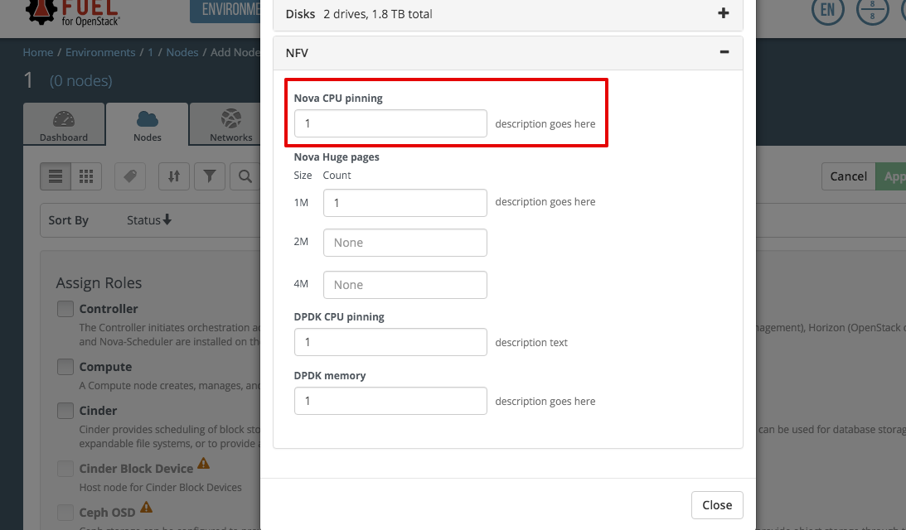

..
 This work is licensed under a Creative Commons Attribution 3.0 Unported
 License.

 http://creativecommons.org/licenses/by/3.0/legalcode

============================================================
Support for NUMA/CPU pinning for improved guests performance
============================================================

https://blueprints.launchpad.net/fuel/+spec/support-numa-cpu-pinning

User should be able to deploy compute nodes which can utilize libvirt driver
handling of the NUMA (Non-Uniform Memory Access) topology and CPU pinning
features

--------------------
Problem description
--------------------

The nature of virtualization means that processes typically use whatever vCPU
is available, but the memory access time depends on the memory location
relative to the processor. NUMA is a computer memory design used in
multiprocessing, where the memory access time depends on the memory location
relative to the processor. Thus, computer may contain several NUMA nodes
with local memory and CPUs each.
To achieve optimal performance also an ability to establish a mapping between
virtual CPU to the physical core is required, and it's covered by CPU pinning.

----------------
Proposed changes
----------------

NUMA topology can be displayed as:

.. code-block:: console

 #numactl -H

  available: 2 nodes (0-1)
  node 0 cpus: 0 1 2 3 4 5 12 13 14 15 16 17
  node 0 size: 128910 MB
  node 0 free: 669 MB
  node 1 cpus: 6 7 8 9 10 11 18 19 20 21 22 23
  node 1 size: 129022 MB
  node 1 free: 4014 MB
  node distances:
  node   0   1
    0:  10  21
    1:  21  10

Here we can see that NUMA topology contains 2 NUMA nodes with 12 CPUs each.

Additional information about NUMA/CPU pinning support in OpenStack [1]_

Enabling NUMA/CPU pinning requires:

* Collect information about NUMA topology from discovered nodes

* Possibility to configure CPU pinning via API/CLI/Web UI

* User may specify amount of CPUs which should be used by Nova

* Configure Nova on controller/compute nodes to set which cores can be used
  for virtual machines.

* Nova Scheduler filters should be configured accordingly.

Web UI
======

A new section "NFV" will be added to the node information dialog, which will
render node attributes in the common format which is used for the cluster
and master node attributes. As described in the data model, Nova CPU pinning
section will be rendered as a text field with single number - amount of CPUs.
Only basic validation (i.e. by regexp) for that field will be performed.

A new section "NUMA topology" will be added to the node information dialog.

Also this section contains information about CPU pinning configuration for
DPDK [2]_, Nova Huge Pages [3]_, DPDK Huge Pages [2]_.

Nailgun
=======

The Nailgun-agent have to collect information about NUMA topology.
Information will be collected by using `lstopo`.

Collected information should be passed to nailgun in the next format:

.. code-block:: json

  'numa_topology': {
    'available_hugepages': ['2M', '1G']
    'numa_nodes': [
       {'id': 0,
       'cpus': [0, 1, ..., 5, 12, 13, ..., 17],
       'memory: 135171932160},
       {'id': 1,
        'cpus': [6, 7, ..., 11, 18, 19, ..., 23],
        'memory': 135289372672}]
    ],
    'distances': [
      [1.0, 2.1],
      [2.1, 1.0]
    ]
  }

The Nailgun changes:

* New handlers and validators
* Extend node db model
* Deployment serializer must process CPU pinning information

Data model
----------

Nailgun-agent will send information about node NUMA topology.
This information will be stored in node metadata

.. code-block:: json

 node.metadata = {
   ...
   'numa_topology': {
     ...
   }
   ...
 }

Node will be extended with `attributes` column:

.. code-block:: python

 class Node(Base):
     ...
     attributes = Column(MutableDict.as_mutable(JSON), default={})
     ...

where User's CPUs configuration will be stored as

.. code-block:: json

  node.attributes = {
    ...
    'nova_cpu_pinning': {
      'description': "Amount of CPUs for Nova usage",
      'label': "Nova CPU pinning",
      'restrictions': [],
      'type': 'text',
      'value': '4',
      'weight': 10,
      'regex': {
        'source': "^\d+$"
        'error': "Incorrect value"
      }
    },
    'dpdk_cpu_pinning': {
      'description': "Amount of CPUs for DPDK usage",
      'label': "DPDK CPU pinning",
      'restriction': [],
      'type': 'text'
      'value': '3',
      'weight': 20,
      'regex': {
        'source': '^\d+$",
        'error': "Incorrect value"
      }
    }
    ...
  }

All values will be '0' by default.
Nailgun will specify CPU ids for each Nova and DPDK accordingly to User
configuration and pass this information to astute.yaml:

.. code-block:: yaml

  nova:
    ...
    cpu_pinning: [0, 1, 18, 19]
    enable_cpu_pinning: true
  dpdk:
    ...
    enabled: True
    ovs_core_mask: 0x4
    ovs_pmd_core_mask: 0x6

`cpu_pinning` will be generated per compute node.
`enable_cpu_pinning` will be true in case there are some
compute with pinned CPU. It's global (is generated for all nodes).

DPDK `enable` will be taken from appropriate NIC info [2]_.
Nailgun will calculate cpu masks according to User configuration -
`dpdk_cpu_pinning`

REST API
--------

New handlers should be added

.. code-block:: python

 GET /nodes/(?P<node_id>\d+)/attributes
    returns node attributes

    :http: * 200 (successful)
           * 404 (node not found in db)

 PUT /nodes/(?P<node_id>\d+)/attributes
    update node attributes

    :http: * 200 (attributes are successfully updated)
           * 400 (wrong attributes data specified)
           * 404 (node not found in db)

Validator should check User configuration whether CPU mapping is applicable on
particular node.

Orchestration
=============

For each node with enabled CPU pinning the custom kernel parameters should be
passed to isolate cores for virtual machines

IBP provision supports ability to set custom kernel parameters from provision
data: `provision_info.ks_meta.pm_data.kernel_params` will be extended with
`isolcpus=0,1,18,19` string.

RPC Protocol
------------

None

Fuel Client
===========

Fuel Client have to show node NUMA topology. New command should be added:

.. code-block:: console

  fuel node --node-id 1 --numa-topology

User can use next commands to configure node attributes

.. code-block:: console

  fuel node --node-id 1 --attributes --download/-d
  fuel node --node-id 1 --attributes --upload/-u

Also, appropriate commands should be added to fuel2 client:

.. code-block:: console

  fuel2 node show-numa-topology 1

  fuel2 node download-attributes 1
  fuel2 node upload-attributes 1

Plugins
=======

None

Fuel Library
============

* `scheduler_default_filters` will be configured for nova-scheduler

* `vcpu_pin_set` will be configured for nova-compute

------------
Alternatives
------------

None

--------------
Upgrade impact
--------------

Modify alembic migrations to process new data model.

---------------
Security impact
---------------

None

--------------------
Notifications impact
--------------------

None

---------------
End user impact
---------------

User Web UI/CLI impact described in appropriate sections.

------------------
Performance impact
------------------

* Performance of virtual machines using NUMA/CPU pinning will be higher
  relatively to virtual machines are not using these features

* It possible that node will have low performance if User allocate not enough
  CPUs for OS

-----------------
Deployment impact
-----------------

`hwloc` should be installed into bootstrap image

----------------
Developer impact
----------------

None

---------------------
Infrastructure impact
---------------------

None

--------------------
Documentation impact
--------------------

Information how CPU pinning works should be documented.

--------------
Implementation
--------------

Assignee(s)
===========

Primary assignee:
  Artur Svechnikov <asvechnikov>
  Sergey Kolekonov <skolekonov>

Other contibutors:
  Alexander Saprykin <cutwater>
  Ivan Ponomarev <ivanzipfer>

QA assignee:
  Ksenia Demina <kdemina>
  Veronica Krayneva <vkrayneva>
  Sergey Novikov <snovikov>

Mandatory design review:
  Igor Kalnitsky <ikalnitsky>
  Sergii Golovatiuk <sgolovatiuk>
  Dmitry Borodaenko <dborodaenko>
  Vitaly Kramskikh <vkramskikh>

Work Items
==========

* Modify Nailgun-agent to discover NUMA topology
* Modify Nailgun to NUMA/CPU pinning configuration processing
* Modify Fuel Library to NUMA/CPU pinning configuration processing
* Support of configuring NUMA/CPU pinning via fuel API
* Support of configuring NUMA/CPU pinning via fuel CLI
* Support of NUMA/CPU pinning on UI
* Manual testing

Dependencies
============

None

------------
Testing, QA
------------

* Extend TestRail with Manual API/CLI cases for the configuring
  NUMA/CPU pinning
* Extend TestRail with Manual WeB UI cases for the configuring
  NUMA/CPU pinning
* Extend TestRail with Manual API/CLI cases for the NUMA topology
* Lead manual CLI testing for the new test cases
* Performance testing
* Extend TestRail with manual cases for NUMA/CPU pinning node functionality
  in OpenStack

Acceptance criteria
===================

* User should be able to deploy compute nodes which can utilize
  NUMA/CPU pinning for virtual machines via Web UI/CLI/API
* New test cases are executed succesfully

----------
References
----------

.. [1] https://specs.openstack.org/openstack/nova-specs/specs/juno/implemented/virt-driver-numa-placement.html
.. [2] https://blueprints.launchpad.net/fuel/+spec/support-dpdk
.. [3] https://blueprints.launchpad.net/fuel/+spec/support-hugepages
